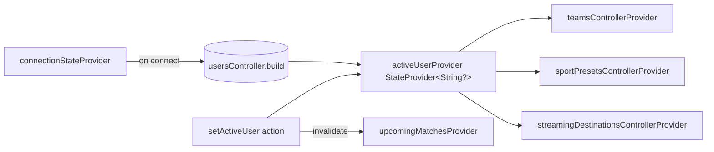

# feat: Settings page reshape

## Summary

Reshape the Settings tab in 11 units: introduce User and StreamingDestination domain types and BLE interface methods, build a shared in-memory dev data store (gated to dev-mock builds; non-mock builds throw cleanly until firmware lands) with cascade-delete on user removal, wire `MockBleService` and `BleServiceImpl`, add Riverpod providers with explicit `userId` plumbing and active-user invalidation, then rebuild the Settings page as a four-section layout with an empty state, a four-button camera card (Reboot / Update fw / Disconnect / Diagnostics), inline user management, an adaptive streaming-destination form, and an integration test for active-user data scoping.

---

## Problem Frame

The current Settings page carries cards that don't belong (Recording defaults are in the Match flow, Connectivity exposes non-tunable transports, Connect-different-camera implies a multi-camera model that doesn't exist) and has no notion of a User even though all camera-stored data is meant to be segmented by who owns it. The reshape also adds two new capabilities — multi-user organization on a single camera and per-user live-streaming destinations — that require new domain types and BLE surface area, plus a coherent way for the Dart side to talk to the camera before firmware lands. See origin: `docs/brainstorms/settings-page-reshape-requirements.md` for the full Problem Frame.

---

## Requirements

**Empty state**
- R1. Settings shows a full-screen "Connect camera" prompt with one primary CTA when no camera is connected; no section cards visible.
- R2. The empty state matches Match and Teams visually so the three tabs feel like one product when no camera is paired.

**Camera section**
- R3. Connected-camera card shows display name, firmware version, proto version, connection dot.
- R4. Card exposes Reboot / Update fw / Disconnect / Diagnostics. Disconnect drops the BLE link only; the camera stays in the known list and one tap on "Connect camera" reconnects without rescanning.
- R5. Diagnostics is realized as a button on the camera card (one of four, in a 2×2 grid), opening the existing `DiagnosticsPage` unchanged.
- R6. The "Connect a different camera" row is removed.

**User section**
- R7. Active user shown inline at the top of the section; all camera-scoped data is segmented by this user.
- R8. User can switch the active user; teams / matches / streaming destinations reload to reflect the new user.
- R9. User can add a new user via a bottom-sheet form (display name, required).
- R10. Deleting the active user is blocked until another is selected. Deleting the last user on the camera is blocked outright. Deleting any user is also blocked while a live match is in progress that references that user's team / preset / streaming destination — the delete affordance is disabled with an inline message until the match ends. Otherwise a delete confirms with a destructive dialog whose body enumerates the cascaded scope ("Deleting `<name>` permanently removes their teams, match history, sport setups, and streaming destinations. This cannot be undone."), and **cascade-deletes** that user's teams, team matches, sport presets, and streaming destinations.

**Match Setup**
- R11. Match Setup is a nav row that opens the existing Sport setups page (extended).
- R12. Each sport in `kSports` has at least one built-in default format that is read-only.
- R13. Custom formats per sport are user-editable / deletable and visually distinguished from built-ins.

**Streaming Setup**
- R14. Streaming Setup lists the active user's destinations with name + provider badge + protocol pill.
- R15. Destination shape: `{ name, provider ∈ {youtube, tiktok, facebook, instagram, custom}, protocol ∈ {rtmp, rtmps, rtsp}, config }` — protocol-specific config; lives on the camera; fetched per active user.
- R16. For known providers (YT/TT/FB/IG) protocol is fixed to RTMP; form prompts Name + URL + Stream key.
- R17. For provider = custom, the user picks the protocol; fields adapt — RTMP/RTMPS prompt URL + Stream key, RTSP prompts URL + optional Username + optional Password.
- R18. Add / edit / delete supported.
- R19. URL fields validate against the chosen protocol's expected scheme before save.

**App section / removals**
- R20. App section anchored at bottom: Theme, Permissions, About. Diagnostics removed (moved up per R5).
- R21. Recording defaults card removed.
- R22. Connectivity card removed.

**Origin actors:** A1 (camera operator, phone-side), A2 (ScoutCamera, camera-side).
**Origin flows:** F1 (connect from empty state), F2 (disconnect and reconnect), F3 (switch active user), F4 (add destination, known provider), F5 (add destination, custom platform).
**Origin acceptance examples:** AE1 (covers R1, R3), AE2 (R4), AE3 (R8), AE4 (R10), AE5 (R12, R13), AE6 (R16), AE7 (R17), AE8 (R19).

---

## Scope Boundaries

- Forget / unpair camera flow.
- Cloud-synced or remote-auth users; OAuth integrations with streaming platforms.
- Multi-camera support.
- Streaming protocols beyond RTMP / RTMPS / RTSP.
- Redesign of `DiagnosticsPage` (relocated only).
- Migrating deleted cards' settings into other pages.

### Deferred to Follow-Up Work

- **Proto schema authoring for User and the new StreamingDestination CRUD commands.** Firmware-track work; the Dart-side contract this plan implements is the authoritative shape for that future work to ratify. The obsolete `SetStreamingConfigCommand` / flat `StreamingConfig` proto messages are left in place for now.
- **Real `BleServiceImpl` integration for the new methods.** In v1, `BleServiceImpl` delegates to `DevDataStore` only when `kAppEnv.isMock` is true; in `devDevice` and `prod` builds it throws a clearly-labeled `StateError("Phase 7: <method> not yet wired to firmware")`. Phase 7 firmware integration replaces these throws method-by-method.
- **Pre-existing `UnimplementedError` stubs in `BleServiceImpl`** (teams, players, sport presets) — out of scope for this plan; this plan only avoids *adding* new ones for the user / streaming surface.
- **Camera-side cascade-delete semantics.** The cascade behavior in R10 is enforced as a Dart-side invariant of `DevDataStore` for v1. Real firmware may adopt orphan-and-reclaim or tombstone semantics instead; if so, U11's `AE4 + cascade` probe (which asserts data-is-gone post-delete) will need to be relaxed when proto authoring begins, but the UI rules in R10 still hold.

---

## Context & Research

### Relevant Code and Patterns

- `lib/pages/settings_page.dart` — page being rewritten.
- `lib/pages/match_page.dart` (`_ConnectCameraScreen`) — empty-state pattern to mirror.
- `lib/pages/teams_page.dart` — same empty-state pattern, second reference.
- `lib/pages/team_form_sheet.dart`, `lib/pages/sport_preset_form_sheet.dart` — bottom-sheet form pattern to mirror for new forms.
- `lib/pages/sport_presets_page.dart` — existing built-in-vs-custom split (extended in this plan).
- `lib/pages/discovery_page.dart` — scan & connect destination, reused as the fallback when one-tap reconnect fails.
- `lib/ble/ble_service.dart` — abstract surface; stable list/create/update/delete shape per camera-owned domain (teams, sport presets) is the template for new user + streaming methods.
- `lib/ble/mock_ble_service.dart` — process-global static stores; pattern for the new in-memory data layer.
- `lib/ble/ble_service_impl.dart` — pre-existing `UnimplementedError` stubs documented as Phase 7 work; new methods avoid this pattern via mock-companion delegation.
- `lib/state/app_data.dart` — `activeCameraIdProvider`, `TeamsController`, `SportPresetsController` (AsyncNotifier) provide the controller pattern for new providers.
- `lib/state/ble_providers.dart` — provider declarations.
- `lib/models/sport_preset.dart` — `Foo` / `FooDraft` immutable pair pattern.
- `lib/models/team.dart` — `kSports` constant defines the sport list R12 must cover.
- `lib/widgets/wf_button.dart`, `lib/widgets/wf_card.dart`, `lib/theme/tokens.dart` — visual primitives.

### Institutional Learnings

None — `docs/solutions/` does not exist in this repo.

### External References

None gathered. Local patterns are dense and consistent; this plan extends them rather than introducing new ones.

---

## Key Technical Decisions

- **Shared `DevDataStore` for in-memory state, gated to dev-mock builds.** A process-global store under `lib/ble/dev_data_store.dart` holds users, streaming destinations, and per-user-keyed teams / team matches / sport presets. `MockBleService` always delegates to it. `BleServiceImpl` delegates only when `kAppEnv.isMock` is true; in `devDevice` and `prod` builds it throws `StateError("Phase 7: <method> not yet wired to firmware")` — the same effective contract as the existing UnimplementedError stubs for older domains, just labeled differently. Rationale: keeps the abstraction (single seam for Phase 7) without silently leaking dev-only behavior into non-mock builds.
- **Single source of truth for the active user is `activeUserProvider`.** Controllers read `activeUserProvider` and pass `userId` explicitly into every BleService call. The store's internal `_activeUserId` is a persistence record only — it's returned by `getActiveUser` and written by `setActiveUser`, but it is NEVER the implicit scope for read/write methods called from controllers. `setActive` writes `BleService.setActiveUser` first, then `activeUserProvider` after the call resolves. Rationale: removes the ordering trap between two sources of truth and matches how `activeCameraIdProvider` already gates BleService calls in `_resolveDeviceId`.
- **Active user is a Riverpod `StateProvider<String?>` mirroring `activeCameraIdProvider`.** On connect, `getActiveUser(deviceId)` populates it. On switch, controllers that watch it (`teamsControllerProvider`, `sportPresetsControllerProvider`, `streamingDestinationsControllerProvider`) rebuild naturally. `upcomingMatchesProvider` is invalidated by `setActive` rather than watching `activeUserProvider` — it has no userId arg, and explicit invalidation matches its existing pattern in `TeamsController`. Rationale: smallest change to the existing provider model.
- **`StreamingConfig` is a sealed Dart class.** `RtmpConfig({url, streamKey})` covers both RTMP and RTMPS (the protocol enum carries the distinction); `RtspConfig({url, username?, password?})` is its own case. Rationale: typed adaptive form fields, exhaustive switch at serialization time, easy to extend with SRT etc. without schema churn.
- **Cascade-delete enforced in the data store.** Deleting a user removes that user's teams, team matches, sport presets, and streaming destinations in one transactional method on `DevDataStore`. UI rules (active-user / last-user / live-match blocks) layered on top in the controller. Rationale: enforced once, tested once, can't be skipped from a different call site. Caveat carried in Scope Boundaries: real firmware may adopt different semantics; the cascade contract is Dart-side for v1.
- **Diagnostics is a button on the camera card, not a nav row.** Camera card renders a 2×2 button grid: Reboot, Update fw, Disconnect, Diagnostics. Rationale: parallel-action affordance reads cleaner than a nav row mid-card; preserves the camera section as a single coherent block.
- **One-tap reconnect via `shared_preferences`-persisted last-camera id.** Empty-state CTA tries `bleService.connect(lastId)` directly; on failure or first launch it pushes `DiscoveryPage`. Rationale: no new method on `BleService`; reuses the existing connect path.
- **Built-in sport presets fill every `kSports` value.** Mock seed extended so Volleyball, Rugby, and Other each have ≥1 built-in default (R12). Rationale: cheapest way to honor R12 without firmware coordination; built-ins are flagged with `builtIn: true` already.
- **User management UI lives inline in the User section.** Active row + "Manage users" expanded list with per-row delete inside Settings — no dedicated "Users" sub-page. Rationale: matches the form-sheet density already in the app and avoids a near-empty sub-page.
- **Test isolation is automatic, not opt-in.** A shared test harness (`test/test_helpers.dart`) registers `setUp(() => DevDataStore.reset())` and is imported by every test that touches `DevDataStore` directly or transitively (every BLE / state / page / integration test). Rationale: process-global mutable state with opt-in reset is a flake source; making reset automatic is the standard mitigation. ID counters live on the store so they reset with it.

---

## Open Questions

### Resolved During Planning

- *How does the obsolete `SetStreamingConfigCommand` proto interact with the new model?* — It does not. The Dart-side contract introduced here is authoritative for the reshape; the proto message will be re-authored when firmware integration begins (Deferred to Follow-Up Work). The current proto remains in place untouched.
- *Where does the user concept live during dev?* — Process-global `DevDataStore` accessed by `MockBleService` always and by `BleServiceImpl` only when `kAppEnv.isMock` is true; non-mock builds throw `StateError("Phase 7: ...")` until firmware lands.
- *How is one-tap reconnect implemented?* — `shared_preferences`-persisted `lastConnectedDeviceIdProvider` (declared in U7); the empty-state CTA prefers `connect(lastId)` over a fresh scan, with a 5-second `Future.timeout` wrapper, a loading state during the attempt, and a `SnackBar` fallback to `DiscoveryPage` on any failure.
- *Watch vs invalidate for `upcomingMatchesProvider`?* — Invalidated explicitly by `UsersController.setActive`. It has no `userId` arg; explicit invalidation matches its existing `TeamsController` pattern.
- *Single source of truth for active user?* — `activeUserProvider`. Controllers source `userId` from it and pass it explicitly to BleService methods. `DevDataStore._activeUserId` is a persistence record only; CRUD methods do NOT default to it.
- *Is cascade-delete a Dart-side or firmware-side contract?* — Dart-side for v1 (UI rules + `DevDataStore` invariant). Firmware may differ; revisit U11's cascade probe when proto authoring begins.

### Deferred to Implementation

- Exact UI density of the "Manage users" inline list (drawer, expandable card, or a flat list under the active row). Pick whichever fits the existing `WfCard` rhythm during U8.
- Whether the `streaming_destination_form_sheet` provider picker is rendered as segmented chips or a dropdown. Either reads as adaptive; let the wireframe density decide.
- Exact `WfButton` size and grid spacing on the four-button camera card (small vs. medium). Pick what reads cleanest at typical phone widths during U7.
- Whether `setActiveUser` returns the updated user list or the app refetches. Either is fine; pick the shape that minimizes round-trips during U5.
- Exact mechanism for detecting "live match in progress that references this user" in U8's delete pre-check. `LiveMatchController` exposes the active match's team / preset / streaming destination ids; the controller can scan them. Implementation detail.

---

## High-Level Technical Design

> *This illustrates the intended approach and is directional guidance for review, not implementation specification. The implementing agent should treat it as context, not code to reproduce.*

**Streaming destination model (sketch):**

```text
StreamingDestination
  id: String
  name: String
  provider: StreamingProvider  // youtube | tiktok | facebook | instagram | custom
  protocol: StreamingProtocol  // rtmp | rtmps | rtsp
  config: StreamingConfig      // sealed: RtmpConfig | RtspConfig

RtmpConfig  { url: String, streamKey: String }
RtspConfig  { url: String, username: String?, password: String? }

invariants:
  provider in {youtube, tiktok, facebook, instagram} => protocol == rtmp
  provider == custom                                  => protocol in {rtmp, rtmps, rtsp}
  protocol in {rtmp, rtmps}                           => config is RtmpConfig
  protocol == rtsp                                    => config is RtspConfig
```

**Active-user provider topology:**



**Dev-mode service topology:**

```text
BleService (abstract)
  ├── MockBleService     ─── always delegates to DevDataStore
  └── BleServiceImpl     ─── delegates to DevDataStore IF kAppEnv.isMock
                             else throws StateError("Phase 7: ... not yet wired to firmware")

         lib/ble/dev_data_store.dart (process-global; reset() auto-fired in tests)

  When firmware lands (Phase 7), individual BleServiceImpl methods
  swap from the gated DevDataStore delegation to real proto round-trips,
  one method at a time. MockBleService is unaffected.
```

---

## Implementation Units

- U1. **Domain models for User and StreamingDestination + `BleService` interface extension**

**Goal:** Stand up the typed surface every later unit depends on. New models, new methods on the abstract interface, no behavior wired yet.

**Requirements:** R7-R10, R14-R19.

**Dependencies:** None.

**Files:**
- Create: `lib/models/user.dart`
- Create: `lib/models/streaming.dart`
- Modify: `lib/ble/ble_service.dart`
- Test: `test/models/user_test.dart`
- Test: `test/models/streaming_test.dart`

**Approach:**
- `UserRecord(id, name)` and `UserDraft(id, name)` as immutable Dart records mirroring `SportPreset` / `SportPresetDraft`.
- `enum StreamingProvider { youtube, tiktok, facebook, instagram, custom }`.
- `enum StreamingProtocol { rtmp, rtmps, rtsp }`.
- Sealed `StreamingConfig` with two cases: `RtmpConfig({url, streamKey})` and `RtspConfig({url, username?, password?})`.
- `StreamingDestination(id, name, provider, protocol, config)` and `StreamingDestinationDraft` (no id required on create).
- Extend `BleService`: `listUsers`, `createUser`, `updateUser`, `deleteUser`, `getActiveUser`, `setActiveUser`, `listStreamingDestinations`, `createStreamingDestination`, `updateStreamingDestination`, `deleteStreamingDestination`. All take `String deviceId` first; streaming reads/mutations are implicitly scoped to the camera's active user.
- Do NOT modify `BleServiceImpl` or `MockBleService` in this unit — interface only. They go red until U2/U3/U4 land.

**Patterns to follow:**
- `lib/models/sport_preset.dart` — `Foo` / `FooDraft` shape.
- `lib/ble/ble_service.dart` teams + sport-preset CRUD section — header comment style and method ordering.

**Test scenarios:**
- Happy path: `UserRecord` and `UserDraft` round-trip through `copyWith`-style construction with all fields preserved.
- Happy path: `StreamingDestination` with `RtmpConfig` constructs and exposes provider, protocol, and config correctly for each known provider (YT/TT/FB/IG) and `custom`.
- Happy path: `StreamingDestination` with `RtspConfig` constructs with and without username/password.
- Edge case: equality holds for two `StreamingDestination` values built from the same fields (since these are intended for AsyncNotifier diffing).
- Edge case: an exhaustive switch on `StreamingConfig` handles both subtypes (compiler-enforced, but a smoke test asserts via pattern matching).

**Verification:**
- `just test` passes the new model tests.
- `just analyze` is clean.
- `BleServiceImpl` and `MockBleService` no longer compile (expected — fixed in U3/U4).

---

- U2. **Shared `DevDataStore` — users, streaming destinations, per-user scoping, cascade-delete**

**Goal:** Single in-memory data layer used by both services. Owns users, streaming destinations, and per-user-keyed views of teams / team matches / sport presets, plus the cascade-delete invariant.

**Requirements:** R7-R10, R14-R18 (data shape and cascade behavior).

**Dependencies:** U1.

**Files:**
- Create: `lib/ble/dev_data_store.dart`
- Test: `test/ble/dev_data_store_test.dart`

**Approach:**
- Singleton accessed via `DevDataStore.instance` (process-global, mirrors how `MockBleService` already keeps static stores).
- Internal state: `Map<String, UserRecord> _users`, `String? _activeUserId`, `Map<String, List<TeamRecord>> _teamsByUser`, `Map<String, Map<String, List<TeamMatch>>> _matchesByUserAndTeam`, `Map<String, List<SportPreset>> _presetsByUser`, `Map<String, List<StreamingDestination>> _destinationsByUser`.
- **Seed eagerly at construction** (not lazily on first access). Two users seeded (`Coach Diego`, `Coach Maria`); existing seed teams / matches / presets assigned to user 1; user 2 starts empty so the wireframe can demonstrate isolation. The eager seed ensures tests that don't set an active user still receive the seed under the default user.
- Built-in sport presets seeded for every entry in `kSports` (Soccer, Basketball, Hockey already covered; add Volleyball, Rugby, Other) — applied per user (each user gets the same built-ins).
- `deleteUser(userId)` removes the user record and cascades: drops `_teamsByUser[userId]`, the corresponding team-match maps, `_presetsByUser[userId]`, and `_destinationsByUser[userId]` in one method. Throws if user is the last remaining user or is the active user (UI is expected to gate, but this is the safety net). The cascade is a Dart-side invariant — see Scope Boundaries: real firmware may differ.
- `setActiveUser(userId)` validates membership and updates `_activeUserId` (persistence record only).
- **CRUD methods require an explicit userId from the caller.** Controllers source it from `activeUserProvider` and pass it in. The store does NOT default to `_activeUserId` for read/write methods — that shortcut creates a sync hazard with the Riverpod source of truth. (`getActiveUser` is the only method that reads `_activeUserId`.)
- ID generation: stable counters per collection (`_userIdCounter` etc.) live on the store, formatted like existing `'team-${++_counter}'`. Counters reset with `DevDataStore.reset()`.
- **`reset()` helper:** clears all maps and counters, re-runs the eager seed. Called automatically in test setUp via the shared harness (see Key Technical Decisions); never called from production code.

**Patterns to follow:**
- `lib/ble/mock_ble_service.dart` — static `_teams`, `_teamMatches`, `_sportPresets`, `_teamIdCounter` patterns; mirror style/signatures.

**Test scenarios:**
- Happy path: create a user, list returns it; create three users, list returns three.
- Happy path: setActiveUser to user A, listTeams returns user A's teams; switch to user B, listTeams returns user B's (empty seed).
- Happy path: createTeam / createSportPreset / createStreamingDestination all attach to the active user; switching users hides them.
- Edge case: every sport in `kSports` has at least one built-in preset after seed.
- Edge case: built-ins are read-only — `updateSportPreset` / `deleteSportPreset` against a `builtIn: true` preset throws.
- Error path: deleteUser of the active user throws.
- Error path: deleteUser of the only remaining user throws.
- **Integration scenario (cascade-delete):** Given user A has 2 teams, 4 team matches, 1 custom preset, 3 streaming destinations, when user A is deleted (after switching active to user B), then `_teamsByUser`, `_matchesByUserAndTeam`, `_presetsByUser`, `_destinationsByUser` no longer contain any entry for user A. Built-in presets remain only for surviving users.
- Integration scenario: createUser sets the active user when there were none before (first-user bootstrap); subsequent createUser calls do not change active user.
- Edge case: streaming destination with `RtmpConfig` round-trips through create + list; same for `RtspConfig` with and without optional credentials.

**Verification:**
- `just test test/ble/dev_data_store_test.dart` passes.
- Cascade test fails loudly if any of the four collections is missed — checked explicitly per collection.
- Test harness file (`test/test_helpers.dart`) created in this unit and exposes a single import that registers `setUp(() => DevDataStore.reset())`.

---

- U3. **`MockBleService` — wire to `DevDataStore`, retrofit existing CRUD to scope by active user**

**Goal:** Mock service implements the new `BleService` methods via `DevDataStore` and routes existing teams/matches/sport-presets through the same store. Tests already covering the mock keep passing.

**Requirements:** R7-R10, R14-R18 (mock-side wiring).

**Dependencies:** U1, U2.

**Files:**
- Modify: `lib/ble/mock_ble_service.dart`
- Modify: `test/ble/mock_ble_service_test.dart`

**Approach:**
- Replace static `_teams`, `_teamMatches`, `_sportPresets` with delegation to `DevDataStore.instance`.
- Implement `listUsers`, `createUser`, `updateUser`, `deleteUser`, `getActiveUser`, `setActiveUser` as one-line delegations.
- Implement streaming CRUD as one-line delegations.
- Existing methods (listTeams, listSportPresets, etc.) now read from the store under the current active user.
- Preserve seed data shape so existing widget/integration tests don't break — the store seeds users/teams identically to today's mock.
- ID generation moves to the store; remove `_teamIdCounter` etc. from `MockBleService`.

**Patterns to follow:**
- `lib/ble/mock_ble_service.dart` existing CRUD methods — header comments and signatures stay identical; only bodies change.

**Test scenarios:**
- Happy path: existing `mock_ble_service_test.dart` cases still pass after the retrofit (regression guard).
- Happy path: `createUser` via `MockBleService` round-trips through `listUsers`.
- Happy path: `setActiveUser` to user B + `listTeams` returns user B's teams.
- Happy path: `createStreamingDestination` for the active user appears in `listStreamingDestinations`; not visible after `setActiveUser` to a different user.
- Error path: `deleteUser` of the active user throws (mock surfaces the store's exception type).
- Integration scenario: cascade through the public API — create user, populate teams + presets + destinations, switch to other user, delete first user, verify all four collections are empty for the deleted user when probed via the public API.

**Verification:**
- `just test test/ble/` passes.
- `mock_ble_service_test.dart` passes both in standard order and with `flutter test --test-randomize-ordering-seed=random` to verify test isolation under shuffled order.
- No reference to the old static `_teams` / `_teamMatches` / `_sportPresets` remains in `mock_ble_service.dart`.

---

- U4. **`BleServiceImpl` — gated DevDataStore delegation (dev-mock only); throws cleanly otherwise**

**Goal:** `BleServiceImpl` honors the new `BleService` surface without adding new `UnimplementedError` calls. In dev-mock builds it delegates to `DevDataStore`; in `devDevice` and `prod` builds it throws `StateError` with a Phase-7 label until firmware lands.

**Requirements:** R7-R10, R14-R18 (impl-side wiring).

**Dependencies:** U1, U2.

**Files:**
- Modify: `lib/ble/ble_service_impl.dart`
- Test: `test/ble/ble_service_impl_dev_methods_test.dart`

**Approach:**
- Add the new abstract methods to `BleServiceImpl`. Each method body checks `kAppEnv.isMock`: if true, delegate to `DevDataStore.instance`; if false, throw `StateError("Phase 7: <method> not yet wired to firmware")`.
- Comment header style: `// TODO (Phase 7): replace the kAppEnv.isMock gate with a real proto round-trip when firmware lands.`
- Do not touch the existing `UnimplementedError` methods (teams / sport presets) — out of scope.

**Patterns to follow:**
- `lib/ble/ble_service_impl.dart` existing Phase-7-pending header style.
- `lib/env.dart` `kAppEnv.isMock` gate.

**Test scenarios:**
- Happy path (mock env): with `kAppEnv.isMock == true`, `BleServiceImpl().createUser(...)` returns the created `UserRecord` and round-trips through `listUsers`.
- Happy path (mock env): `BleServiceImpl().createStreamingDestination(...)` round-trips through `listStreamingDestinations`.
- Happy path (mock env): `BleServiceImpl()` and `MockBleService()` see the same data via the shared `DevDataStore` — instantiate one, write through it, instantiate the other, read it back.
- Error path (non-mock env): with `kAppEnv.isMock == false`, every new method throws `StateError` whose message contains "Phase 7".
- Error path: `deleteUser` of the active user throws the data-store's typed exception in mock env (consistent with `MockBleService`).

**Verification:**
- `just test test/ble/ble_service_impl_dev_methods_test.dart` passes both env paths.
- `grep "UnimplementedError" lib/ble/ble_service_impl.dart` does not match any of the new method names.
- `grep "Phase 7" lib/ble/ble_service_impl.dart` matches every new method's non-mock branch.

---

- U5. **State providers: `activeUserProvider`, `UsersController`, `StreamingDestinationsController`, cross-provider invalidation**

**Goal:** Active-user state and controllers wire the new `BleService` surface into Riverpod. Switching the active user causes existing per-user controllers to rebuild.

**Requirements:** R7-R10, R14-R18 (state side).

**Dependencies:** U1, U2, U3, U4 (interface and one runtime impl needed; both ideally).

**Files:**
- Modify: `lib/state/app_data.dart`
- Modify: `lib/state/ble_providers.dart` (only if a new family/stream provider is added)
- Test: `test/state/active_user_providers_test.dart`

**Approach:**
- `activeUserProvider = StateProvider<String?>((_) => null)`.
- `UsersController extends AsyncNotifier<List<UserRecord>>`:
  - `build()` reads `listUsers(deviceId)`. If `activeUserProvider` is null and the camera has a current user, hydrate it from `getActiveUser(deviceId)`. If `getActiveUser` returns null (camera has no active user — possible if the previously-active user was deleted out of band, all users were deleted, or firmware just shipped without active-user concept), leave `activeUserProvider` null; downstream controllers handle the null case by returning empty lists, and the User section UI in U8 renders a "Pick a user" prompt instead of an active-user row.
  - `create(name)` / `delete(id)` / `setActive(id)` — call through `BleService`, then `_refresh()`. `setActive` calls `BleService.setActiveUser` first, then writes `activeUserProvider` after the call resolves (this ordering matters — see Key Technical Decisions on single source of truth).
  - `delete(id)`: pre-checks UI invariants (last-user / active-user / live-match-in-progress blocks) and surfaces a typed exception so the form can render an inline message.
- `StreamingDestinationsController extends AsyncNotifier<List<StreamingDestination>>`:
  - `build()` watches `activeUserProvider`; rebuilds when it changes. Reads `listStreamingDestinations(deviceId, activeUserId)` — `activeUserId` is passed explicitly, sourced from `activeUserProvider`. When `activeUserProvider` is null, returns the empty list without making a BLE call.
  - `create(draft)` / `update(draft)` / `delete(id)` standard pattern; all pass `activeUserId` explicitly to `BleService`.
- Existing controllers (`TeamsController`, `SportPresetsController`) updated to add `ref.watch(activeUserProvider)` in `build()` so they rebuild on user switch, and pass `activeUserId` explicitly to BleService methods. **Note for non-mock builds:** because `BleServiceImpl.listTeams` / `listSportPresets` still throw `UnimplementedError` (out of scope of this plan, see Scope Boundaries), every refetch in `devDevice` / `prod` env will surface as `AsyncError` — the same throw the app already produces for those reads today, just fired more often. End-to-end usability of teams / presets in non-mock builds was already gated on Phase 7 firmware integration before this plan.
- `upcomingMatchesProvider` is invalidated explicitly by `UsersController.setActive` rather than watching `activeUserProvider` — it has no `userId` arg, and explicit invalidation matches its existing pattern in `TeamsController`.
- On `connectionStateProvider` transition to connected: hydrate `usersControllerProvider` (existing app-level wiring picks this up; UI in U6 watches the controller and triggers `build()` lazily).

**Patterns to follow:**
- `lib/state/app_data.dart`: `TeamsController`, `SportPresetsController` shape — `_resolveDeviceId`, `_requireDevice`, `_refresh`, `AsyncNotifierProvider`.

**Test scenarios:**
- Happy path: with `MockBleService` overridden, `usersControllerProvider` returns the seed user list.
- Happy path: `setActive(userId)` updates `activeUserProvider`.
- Happy path: switching `activeUserProvider` causes `teamsControllerProvider` to refetch (new value reflects target user's seed).
- Happy path: `streamingDestinationsControllerProvider.build()` returns the active user's destinations and rebuilds on user switch.
- Happy path: `setActive(userId)` writes BleService first, then `activeUserProvider` (verifiable via mock spy: BleService call ordered before Riverpod state mutation).
- Edge case: with no camera connected, all controllers return empty lists (existing convention).
- Edge case: when `getActiveUser` returns null, `activeUserProvider` stays null; `streamingDestinationsControllerProvider` and `teamsControllerProvider` return empty without throwing.
- Error path: `usersController.delete(activeUserId)` throws the typed UI-rule exception without performing the BLE call.
- Error path: `usersController.delete(lastUserId)` throws the typed UI-rule exception.

**Verification:**
- `just test test/state/` passes.
- Switching active user in a test container causes `teamsControllerProvider`, `sportPresetsControllerProvider`, `streamingDestinationsControllerProvider`, and `upcomingMatchesProvider` to all settle to user-B values.

---

- U6. **Settings page shell — empty state + four-section layout + App at bottom; remove deleted cards**

**Goal:** Rebuild `settings_page.dart` from scratch as the four-section layout. No new behaviors yet — this unit produces the shell that U7-U10 fill in.

**Requirements:** R1, R2, R20, R21, R22; covers F1.

**Dependencies:** U5.

**Files:**
- Modify (rewrite): `lib/pages/settings_page.dart`
- Test: `test/pages/settings_page_shell_test.dart`

**Approach:**
- When `connectionStateProvider(activeId)` is not connected (or `activeCameraIdProvider` is null), render `_ConnectCameraEmptyState` — full-screen, mirrors `_ConnectCameraScreen` from `match_page.dart`.
- When connected: a `ListView` with sections in this order:
  1. Camera (placeholder card — filled in U7)
  2. User (placeholder — U8)
  3. Match Setup (one nav row — uses existing `SportPresetsPage`, untouched)
  4. Streaming Setup (placeholder — U9)
  5. App — Theme / Permissions / About (Diagnostics removed since R5 places it on the camera card)
- Delete `_NoCameraCard`, `_DiscoveryRow`, the Recording defaults block, the Connectivity block, the Diagnostics row in App.
- Section spacing matches existing settings rhythm (14 px) and uses `WfSection` headers.

**Patterns to follow:**
- `lib/pages/match_page.dart` `_ConnectCameraScreen` — empty state.
- `lib/pages/teams_page.dart` no-camera path — second reference.
- `lib/widgets/wf_card.dart`, `lib/theme/tokens.dart` — visual primitives.

**Test scenarios:**
- **Covers AE1.** Happy path: with no camera connection (active id null), the page renders only the empty-state CTA and no section cards are present in the widget tree.
- Happy path: with a camera connected (mock service + active id set), all four sections and the App section are present and ordered Camera → User → Match Setup → Streaming Setup → App.
- Edge case: `connectionStateProvider` transitions from connected → disconnected — page rerenders to the empty state without crashing.
- Integration scenario: tapping the empty-state CTA navigates to `DiscoveryPage` (this is the fallback when no last-camera id is persisted; the one-tap reconnect path is added in U7).

**Verification:**
- `just test test/pages/settings_page_shell_test.dart` passes.
- The Recording defaults, Connectivity, and old "Connect a different camera" rows do not appear anywhere in the rendered tree.

---

- U7. **Camera section — 2×2 button card (Reboot / Update fw / Disconnect / Diagnostics) + last-camera persistence + one-tap reconnect**

**Goal:** Camera card with four buttons, working Disconnect, persisted last-camera id, and a one-tap reconnect from the empty state.

**Requirements:** R3, R4, R5, R6; covers F1, F2.

**Dependencies:** U6, U5.

**Files:**
- Modify: `lib/pages/settings_page.dart`
- Modify: `lib/state/app_data.dart` (or new `lib/state/last_camera.dart` if cleaner) — declares `lastConnectedDeviceIdProvider` here in U7 (not earlier in U5; this is the only consumer).
- Test: `test/pages/settings_camera_section_test.dart`
- Test: `test/state/last_camera_test.dart`

(`shared_preferences ^2.3.3` is already in `pubspec.yaml` — no dep change needed.)

**Approach:**
- Camera card content unchanged at top (name, fw, proto, dot).
- Replace the existing two-button row with a 2×2 `WfButton` grid: Reboot, Update fw (top); Disconnect, Diagnostics (bottom). Use small button size to keep the card compact.
- **Reboot / Update fw buttons** render disabled (`onPressed: null` → `WfButton`'s opacity 0.5) with a `Tooltip` wrapping each ("Coming soon — firmware integration"). They are placeholders explicitly until firmware lands; the tooltip removes the "broken or just disabled?" ambiguity.
- Diagnostics button pushes the existing `DiagnosticsPage` route (untouched).
- Disconnect: calls `bleService.disconnect(activeId)`; on resolution, clears `activeCameraIdProvider`; the page rerenders to the empty state.
- New `lastConnectedDeviceIdProvider` over `shared_preferences` exposes the persisted last-camera id. Persist on every successful connect (hook into existing connect path in `DiscoveryPage` post-connect step or the `connectionStateProvider` listener).
- **Empty-state CTA "Connect camera" — full state machine:**
  1. On tap, the button enters a loading state (disabled, label "Connecting…", small inline spinner).
  2. If `lastConnectedDeviceIdProvider` has a value, attempt `bleService.connect(lastId).timeout(Duration(seconds: 5))` (`Future.timeout` wrapper — existing `BleService.connect` has no internal timeout).
  3. On success: page rerenders to the populated four-section layout (controllers refetch via existing wiring).
  4. On `BleConnectionException`, `TimeoutException`, or any other thrown error: push `DiscoveryPage` and surface a `SnackBar` on the discovery scaffold with copy "Couldn't reconnect to last camera — searching for cameras." Reset button state when the page rerenders.
  5. If `lastConnectedDeviceIdProvider` is null (first launch / never connected): push `DiscoveryPage` directly without attempting reconnect — no loading state, no snackbar.
  6. After successful reconnect, if `getActiveUser(deviceId)` returns null, `activeUserProvider` stays null and the User section in U8 renders a "Pick a user" prompt (the populated layout still shows but the User section is in its no-active-user shape).

**Patterns to follow:**
- `lib/widgets/wf_button.dart` `WfButton` API.
- Existing connect flow in `lib/pages/discovery_page.dart` for the post-connect persistence hook.

**Test scenarios:**
- **Covers AE2.** Integration scenario: with a connected camera and a persisted last-camera id, tapping Disconnect drops the connection (page renders empty state); tapping the empty-state CTA shows the loading state, reconnects to the same camera without scanning, and the page renders back to the populated four-section layout.
- Happy path: 2×2 button grid renders four labeled buttons on the camera card; Reboot and Update fw render with `Tooltip("Coming soon — firmware integration")`.
- Happy path: tapping Diagnostics pushes a route whose first page is `DiagnosticsPage`.
- Happy path: between tap and resolution, the empty-state CTA is disabled, shows label "Connecting…", and renders an inline spinner.
- Edge case: with no persisted last-camera id, tapping the empty-state CTA navigates to `DiscoveryPage` immediately — no loading state, no auto-connect attempt.
- Error path: with a persisted last-camera id and a forced `BleConnectionException` from the mock, the empty-state CTA falls back to `DiscoveryPage` and surfaces a `SnackBar` with the "Couldn't reconnect" copy.
- Error path: with a persisted last-camera id where `connect` never resolves, the 5-second `Future.timeout` fires and falls back to `DiscoveryPage` with the same `SnackBar`.
- Edge case: after a successful one-tap reconnect, if `getActiveUser(deviceId)` returns null, the User section renders the "Pick a user" empty shape rather than crashing.
- Edge case: persistence read/write through `SharedPreferences.setMockInitialValues` round-trips correctly.

**Verification:**
- `just test test/pages/settings_camera_section_test.dart test/state/last_camera_test.dart` passes.
- The Reboot and Update fw buttons each have an associated `Tooltip` widget with the placeholder copy.

---

- U8. **User section UI + `user_form_sheet` + delete rules**

**Goal:** Inline active-user row, "Manage users" expanded list with per-row delete, add-user bottom-sheet form, all UI rules from R10.

**Requirements:** R7, R8, R9, R10; covers F3.

**Dependencies:** U6, U5.

**Files:**
- Modify: `lib/pages/settings_page.dart`
- Create: `lib/pages/user_form_sheet.dart`
- Test: `test/pages/settings_user_section_test.dart`
- Test: `test/pages/user_form_sheet_test.dart`

**Approach:**
- Section layout: `WfCard` with the active user's name + "Active" badge at the top, a divider, then a list of all other users with a trailing delete `IconButton`, and an "Add user" row at the bottom.
- **No-active-user shape:** when `activeUserProvider` is null (post-reconnect with no camera-side active user, or empty user list), the section renders a centered `WfNote` "Pick a user to organize your teams, matches, and streaming destinations." plus the user list with a tappable "Make active" trailing affordance per row, plus the "Add user" row. The active row + Active badge are not rendered.
- **User switch dialog:**
  - Title: "Switch user?"
  - Body: "Switch to `<name>`? Your teams, matches, and streaming destinations will reload to show their data."
  - Cancel label: "Cancel"
  - Confirm label: "Switch"
- After confirm: row enters a loading state (small leading spinner replaces the avatar/icon) while `usersController.setActive(userId)` resolves. On success, the section rerenders with the new active user. On error: `ScaffoldMessenger.showSnackBar` with "Couldn't switch user — try again." (matches `sport_presets_page.dart` error pattern); row exits loading state.
- Tapping "Add user" opens `showUserFormSheet` (mirrors `showTeamFormSheet`); a single trimmed text field; submit returns a `UserDraft`.
- **Delete trailing icon → destructive confirm dialog:**
  - Title: "Delete user?"
  - Body: "Deleting `<name>` permanently removes their teams, match history, sport setups, and streaming destinations. This cannot be undone."
  - Cancel label: "Cancel"
  - Confirm label: "Delete user" (red / destructive style)
- The trailing delete icon is disabled (`onPressed: null`) under any of these conditions, with an inline subtitle on the row explaining why:
  - Active user → subtitle "Switch to another user before deleting"
  - Last remaining user → subtitle "Add another user before deleting the last one"
  - Live match in progress that references this user's team / preset / streaming destination → subtitle "End the live match before deleting"
- The controller's pre-check is the safety net — if a delete somehow fires under one of those conditions, the typed exception surfaces as an inline error rather than opening the dialog.
- After any mutation, controllers refresh — the section rerenders.

**Patterns to follow:**
- `lib/pages/team_form_sheet.dart` — bottom-sheet form pattern.
- Existing `WfCard` row treatment in current `settings_page.dart`.

**Test scenarios:**
- **Covers AE3.** Integration scenario: starting on user A with seed teams `[Lions, Tigers]`, tapping user B opens the switch dialog with body text "Switch to `Coach Maria`? Your teams, matches, and streaming destinations will reload to show their data."; confirming switches active user; Teams tab now reflects user B's data; switching back returns to A's data.
- **Covers AE4.** Error path: with a single user remaining, the delete affordance is disabled with subtitle "Add another user before deleting the last one"; after adding user B and switching to B, deleting user A opens the dialog whose body enumerates teams, match history, sport setups, and streaming destinations; confirming succeeds and user A's row disappears.
- Happy path: cascade-delete dialog body literally contains the four cascaded collection names (teams, match history, sport setups, streaming destinations) — assert via widget text matcher.
- Happy path: tapping "Add user" opens the bottom sheet; submitting a non-empty trimmed name appends a new row.
- Edge case: empty / whitespace-only name in the form sheet shows a validation error and does not submit.
- Error path: deleting the active user (without first switching) — affordance disabled with subtitle "Switch to another user before deleting"; row remains.
- Error path: deleting a user with a live match in progress referencing their team — affordance disabled with subtitle "End the live match before deleting".
- Edge case: when `setActive` throws (mock returns error), row briefly shows a loading state then a `SnackBar` "Couldn't switch user — try again." appears; the active row does not change.
- Edge case: when `activeUserProvider` is null (post-reconnect no-active-user state), section renders the "Pick a user" `WfNote` plus user list with "Make active" affordances; the active row is absent.
- Integration scenario: deleting a non-active user that owns 2 teams + 1 streaming destination cascades — after delete, switching to that user is no longer possible (row gone) and the data is gone from `DevDataStore`.

**Verification:**
- `just test test/pages/settings_user_section_test.dart test/pages/user_form_sheet_test.dart` passes.
- The User section renders an active row, at least one non-active row when seed has ≥2 users, an "Add user" row, and never a "Delete" affordance on the active user.

---

- U9. **Streaming Setup section UI + adaptive `streaming_destination_form_sheet`**

**Goal:** List the active user's streaming destinations and provide an add/edit form whose fields adapt by provider and protocol.

**Requirements:** R14, R15, R16, R17, R18, R19; covers F4, F5.

**Dependencies:** U6, U5.

**Files:**
- Modify: `lib/pages/settings_page.dart`
- Create: `lib/pages/streaming_destination_form_sheet.dart`
- Test: `test/pages/settings_streaming_section_test.dart`
- Test: `test/pages/streaming_destination_form_sheet_test.dart`

**Approach:**
- Section layout: a `WfCard` with the destination list — each row showing name, provider chip, protocol pill, plus a trailing `IconButton(Icons.delete_outline)` for delete (matches the `sport_presets_page.dart` row pattern; the brainstorm phrase "trailing menu" is realized as a direct delete icon, not a popup menu, since no popup-menu pattern exists in the codebase). Row tap → edit mode in the bottom sheet. Trailing icon → destructive confirm dialog.
- **Empty state for the section** (active user has zero destinations): render a `WfNote` row "No streaming destinations yet. Tap below to add one." above the "Add destination" row, inside the same `WfCard`. Mirrors `sport_presets_page.dart`'s empty-state copy register.
- Form sheet fields:
  - Provider picker (5 options).
  - If provider ∈ known providers: protocol fixed to `rtmp`, picker hidden. Fields: Name (default = provider label), URL, Stream key.
  - If provider == custom: protocol picker (rtmp / rtmps / rtsp). Fields: Name (required), URL, plus protocol-specific:
    - rtmp / rtmps → Stream key
    - rtsp → Username (optional), Password (optional)
- **Sensitive field treatment.** Stream key, RTSP Username, and RTSP Password fields use `obscureText: true` with a trailing visibility-toggle `IconButton` (`Icons.visibility_outlined` / `Icons.visibility_off_outlined`) that flips `obscureText`. All three fields also set `enableSuggestions: false` and `autocorrect: false` so soft-keyboard autocomplete cannot leak input. The URL field is a normal text field (URLs are not the credential).
- URL validation per protocol (`rtmp://`, `rtmps://`, `rtsp://`); inline error on save.
- On submit, build `StreamingDestinationDraft` with the right `StreamingConfig` subtype and route through `streamingDestinationsController.create` / `.update`.

**Patterns to follow:**
- `lib/pages/sport_preset_form_sheet.dart` — bottom-sheet form with picker + numeric fields and submit / cancel rhythm.
- `lib/widgets/wf_chip.dart` for provider chips and protocol pills.

**Test scenarios:**
- **Covers AE6.** Happy path: provider = YouTube → form shows Name / URL / Stream key only; protocol is fixed to RTMP and the protocol picker is not in the widget tree.
- **Covers AE7.** Integration scenario: provider = Custom + protocol = RTSP renders Name / URL / Username (optional) / Password (optional); switching to RTMP rebuilds the form to Name / URL / Stream key (no username/password fields).
- **Covers AE8.** Error path: protocol = RTMP with URL `https://example.com/x` triggers an inline validation error on save and does not call the controller.
- Happy path: Stream key field has `obscureText == true` by default; tapping the visibility toggle flips it to false.
- Happy path: RTSP Username and Password fields both have `obscureText == true` by default and a working visibility toggle.
- Happy path: Stream key, Username, and Password fields all have `enableSuggestions: false` and `autocorrect: false`.
- Happy path: submitting a valid YouTube destination appears in the section list with a `YouTube` provider chip and an `RTMP` pill plus a trailing `Icons.delete_outline` icon.
- Happy path: with zero destinations under the active user, the section card shows the "No streaming destinations yet" `WfNote` row above the "Add destination" row.
- Happy path: tapping the trailing delete icon opens the destructive confirm dialog; confirming removes the row.
- Happy path: editing an existing destination loads its fields, saves changes, and updates the row in place.
- Edge case: empty Name with provider = Custom is rejected; with a known provider, defaults to the provider label.
- Edge case: trailing whitespace in URL / stream key is trimmed before save.
- Integration scenario: a destination created under user A is not visible after switching to user B.

**Verification:**
- `just test test/pages/settings_streaming_section_test.dart test/pages/streaming_destination_form_sheet_test.dart` passes.
- The form sheet's visible fields match the protocol exactly — no leftover hidden controllers contaminating submits.

---

- U10. **Sport setups extension — built-in visual treatment + complete sport coverage**

**Goal:** Built-ins are visually distinguished from custom presets and every `kSports` value has a default. The page itself stays the same shape (nav target from Settings) — this is incremental polish.

**Requirements:** R11, R12, R13.

**Dependencies:** U2 (built-in seed coverage was added there).

**Files:**
- Modify: `lib/pages/sport_presets_page.dart`
- Test: `test/pages/sport_presets_built_in_test.dart`

**Approach:**
- In each preset row, add a leading "Default" chip (or a different leading icon) when `preset.builtIn == true`. Hide edit and delete affordances on built-ins (verify the existing implementation already hides delete; extend to edit).
- Verify list grouping renders built-ins above custom presets per sport. If grouping doesn't already pin built-ins to the top, sort within group: `builtIn` first, then by name.
- No changes to `SportPreset` model or `BleService` interface.

**Patterns to follow:**
- Existing `sport_presets_page.dart` row treatment.
- `lib/widgets/wf_chip.dart` for the "Default" chip.

**Test scenarios:**
- **Covers AE5.** Happy path: on the soccer group, the built-in `Soccer · Standard` and `Soccer · Youth (U14)` rows render at the top of the group with no edit/delete trailing affordance; any custom row below renders with both affordances.
- Happy path: every entry in `kSports` has at least one row in the page after seed (regression-guards U2's seed completeness).
- Edge case: a group with no custom presets still renders the built-in defaults under the sport header.
- Error path: attempting to delete a built-in preset via the controller (bypassing UI) throws — confirms U2's guard surfaces through.

**Verification:**
- `just test test/pages/sport_presets_built_in_test.dart` passes.
- Visual scan: every sport group has at least one `Default`-tagged row.

---

- U11. **Integration test — empty state, four sections, active-user data scoping end-to-end**

**Goal:** Pin the cross-cutting behaviors that no single unit test can prove: the page transitions correctly, switching user re-scopes data on every tab, and cascade-delete propagates through the UI.

**Requirements:** R1, R7, R8, R10, R14, R15.

**Dependencies:** U6, U7, U8, U9.

**Files:**
- Create: `test/integration/settings_page_test.dart`

**Approach:**
- Boot the full app under `ProviderScope` with `bleServiceProvider` overridden to a `MockBleService` (using a fresh `DevDataStore` instance via a test-only `reset()` helper added in U2 if needed).
- Walk the four cross-cutting flows below as a single test, or split into discrete tests if it reads better.

**Patterns to follow:**
- `test/integration/main_page_test.dart` (existing) — full-app provider override + widget pumping pattern.

**Test scenarios:**
- **Covers F1, AE1.** Integration scenario: app launches with no active camera; Settings shows the empty state. Tapping CTA pushes `DiscoveryPage`; pairing a mock device returns to a populated four-section layout.
- **Covers F2, AE2.** Integration scenario: Disconnect from the camera card returns the page to the empty state; the persisted last-camera id is set, and tapping the CTA shows the loading state, reconnects without rescanning, and renders the populated layout.
- **Covers F3, AE3.** Integration scenario: with two seeded users (A: 2 teams, B: 0 teams), Teams tab shows A's teams; switching active user via the User section to B shows B's empty list with a brief AppBar "Loading…" indicator during the rebuild rather than a full-page spinner; Match tab and Streaming Setup section also reflect the user switch.
- **Covers F4, F5, AE6, AE7.** Integration scenario: under user B, add a YouTube destination (form fixed to RTMP, Stream key field obscured) and a custom RTSP destination; both appear in the section list. Switch back to A; neither is visible.
- **Covers AE4 + cascade.** Integration scenario: with user A holding teams + custom presets + streaming destinations, switch to user B and delete user A. The destructive confirm dialog body literally contains "teams", "match history", "sport setups", and "streaming destinations". Verify A's row is gone; verify the camera-side seed for A's teams / matches / presets / destinations is empty (probe via `MockBleService` with `setActiveUser('user-a')` — should throw, since the user is gone).
- Edge case (null active user post-reconnect): with `getActiveUser` mocked to return null, after one-tap reconnect the User section renders the "Pick a user" prompt; Teams and Streaming sections are empty without crashing.
- Edge case (one-tap reconnect failure): with the mock forced to throw `BleConnectionException` on the persisted lastId, tapping the empty-state CTA falls back to `DiscoveryPage` and surfaces the "Couldn't reconnect" `SnackBar`.

**Verification:**
- `just test-integration` passes.
- Each AE referenced above is materialized in at least one assertion.

---

## System-Wide Impact

- **Interaction graph:** `activeUserProvider` becomes a new fan-out point. `teamsControllerProvider`, `sportPresetsControllerProvider`, and `streamingDestinationsControllerProvider` watch it; `upcomingMatchesProvider` is invalidated explicitly by `setActive`. Any future per-user-scoped provider added later must add the same watch — note this in the AGENTS.md / module conventions if such a doc exists (see Documentation / Operational Notes).
- **Cross-tab transitional UI on user switch.** When `activeUserProvider` changes, every watching controller enters `AsyncValue.loading` until the refetch resolves. To avoid a jarring full-page spinner mid-session in tabs the user isn't currently looking at, controllers expose a `previous` value during the loading phase and the existing `async.when(...)` call sites are updated to render the previous data plus a small "Loading…" indicator in the AppBar (or equivalent compact treatment) while loading. The full-page spinner is reserved for first load (when previous is null).
- **Error propagation:** UI-rule violations (last user, active user delete, live-match delete) surface as typed exceptions from `UsersController.delete`; the User section catches and renders an inline message rather than exploding. `DevDataStore` enforces the same invariants as a safety net so a different call site (e.g., a future test or feature) cannot bypass them.
- **State lifecycle risks:** `DevDataStore` is process-global. Test isolation is automatic via the shared `test/test_helpers.dart` harness that registers `setUp(() => DevDataStore.reset())` — every BLE / state / page / integration test imports it. In `main.dart`, no explicit reset; eager seed runs at construction, hot reload preserves state (matches existing `MockBleService` behavior). Non-mock builds never construct `DevDataStore` because `BleServiceImpl` only references it inside the `kAppEnv.isMock` gate.
- **API surface parity:** Both `MockBleService` and `BleServiceImpl` honor the same new abstract methods. `MockBleService` always delegates to `DevDataStore`; `BleServiceImpl` delegates only in `kAppEnv.isMock` and otherwise throws. Adding a new method requires both implementations to be updated — typed by the abstract class, so the compiler enforces it.
- **Integration coverage:** Cascade-delete and active-user re-scoping are exercised at the data-store level (U2 — full per-collection assertion), the service level (U3 — public-API smoke check), the controller level (U5 — exception-type check), and end-to-end (U11 — UI dialog + post-delete state). Each layer catches a different failure shape.
- **Unchanged invariants:** The existing `BleService` methods, the existing `proto/bluetooth.proto` schema, the existing `DiagnosticsPage` UI, and the per-match recording / quality controls in `match_page.dart` are not modified by this plan. Reboot and Update fw buttons remain visual placeholders with their current (no-op) behavior, plus a tooltip explaining the placeholder status.

---

## Risks & Dependencies

| Risk | Mitigation |
|------|------------|
| `DevDataStore` as a process-global singleton can leak state across tests. | `test/test_helpers.dart` registers `setUp(() => DevDataStore.reset())` and is imported by every test file that touches the store directly or transitively. Reset is automatic, not opt-in. ID counters live on the store so they reset with it. |
| The retrofit in U3 risks breaking existing `mock_ble_service_test.dart` cases that assume static-store seeds. | U3 keeps seed shape identical and runs the existing test file both in standard order and via `flutter test --test-randomize-ordering-seed=random` as a regression guard before adding new tests. |
| `shared_preferences` writes/reads in tests need to round-trip without a real platform. | `SharedPreferences.setMockInitialValues({})` in test harness; gate writes on successful connect only. |
| Cascade-delete scope misses one of the four user-scoped collections. | U2 test asserts each collection independently; any miss fails loudly with the offending collection name. |
| The four-button camera card may crowd at narrow widths. | U7 chooses small `WfButton` size; visual review during U7 catches overflow before merge. |
| Active-user invalidation could race if `setActive` writes Riverpod and the store in different orders. | Single source of truth: `activeUserProvider`. Controllers source `userId` from it and pass it explicitly into BleService methods. The store's `_activeUserId` is a persistence record only, never the implicit scope for read/write. `setActive` writes BleService first, then `activeUserProvider`. |
| `BleServiceImpl` running in `devDevice` / `prod` would silently lose data if it reused `DevDataStore` unconditionally. | `BleServiceImpl`'s new methods are gated on `kAppEnv.isMock`; non-mock builds throw `StateError("Phase 7: ... not yet wired to firmware")` until firmware lands. Symmetrical to existing UnimplementedError stubs for older domains. |
| Cascade-delete during a live match could wipe references the recording is using. | `UsersController.delete` pre-checks `LiveMatchController` state — if a match is live and references the doomed user's team / preset / streaming destination, the delete affordance is disabled with subtitle "End the live match before deleting". The data-store cascade is the safety net; UI gate is the user-facing surface. |
| Camera-side firmware may adopt different cascade semantics (orphan-and-reclaim) than the Dart-side cascade contract. | Dart-side cascade is explicitly an in-app invariant (see Scope Boundaries). U11's `AE4 + cascade` probe will need to be relaxed when proto authoring begins; UI rules in R10 still hold. |

---

## Documentation / Operational Notes

- Update `CLAUDE.md` (or `AGENTS.md` if introduced) to document: `activeUserProvider` exists and any per-user-scoped provider must watch it and pass `userId` explicitly to `BleService`; `DevDataStore` is the dev-mock in-memory home for users + streaming destinations + per-user-scoped data until firmware lands; `BleServiceImpl` gates new methods behind `kAppEnv.isMock` and throws `StateError("Phase 7: ...")` in non-mock builds.
- Update the camera-side notes in `proto/README.md` to flag (a) the obsolete `SetStreamingConfigCommand` / flat `StreamingConfig` proto messages will be replaced when firmware integration begins, with the Dart-side `StreamingDestination` model as the authoritative target shape; and (b) when streaming-destination CRUD commands are authored, credential fields (stream_key, password) must be flagged sensitive in proto comments and proto/README.md must document the required BLE security mode (Authenticated Pairing, Security Mode 1 Level 3+) before the camera accepts writes carrying credentials.
- Non-mock builds (`devDevice`, `prod`) cannot use the new user / streaming features end-to-end until firmware lands. This is documented behavior and matches the existing state of teams / sport presets in non-mock builds. No rollout / monitoring concerns for v1.

---

## Sources & References

- **Origin document:** `docs/brainstorms/settings-page-reshape-requirements.md`
- Settings page being rewritten: `lib/pages/settings_page.dart`
- Empty-state pattern reference: `lib/pages/match_page.dart` (`_ConnectCameraScreen`)
- Form-sheet pattern references: `lib/pages/team_form_sheet.dart`, `lib/pages/sport_preset_form_sheet.dart`
- Controller pattern reference: `lib/state/app_data.dart` (`TeamsController`, `SportPresetsController`)
- BLE interface: `lib/ble/ble_service.dart`
- Mock service: `lib/ble/mock_ble_service.dart`
- Real service: `lib/ble/ble_service_impl.dart`
- Camera-side data convention: `lib/ble/ble_service.dart` teams + sport-presets section header comments
- Visual primitives: `lib/widgets/wf_button.dart`, `lib/widgets/wf_card.dart`, `lib/widgets/wf_chip.dart`, `lib/theme/tokens.dart`
- Sport list: `lib/models/team.dart` (`kSports`)
- Existing integration test pattern: `test/integration/main_page_test.dart`
