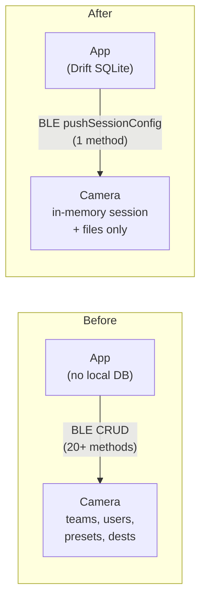
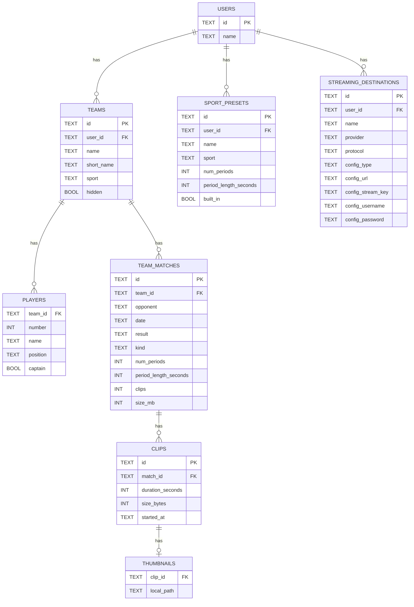
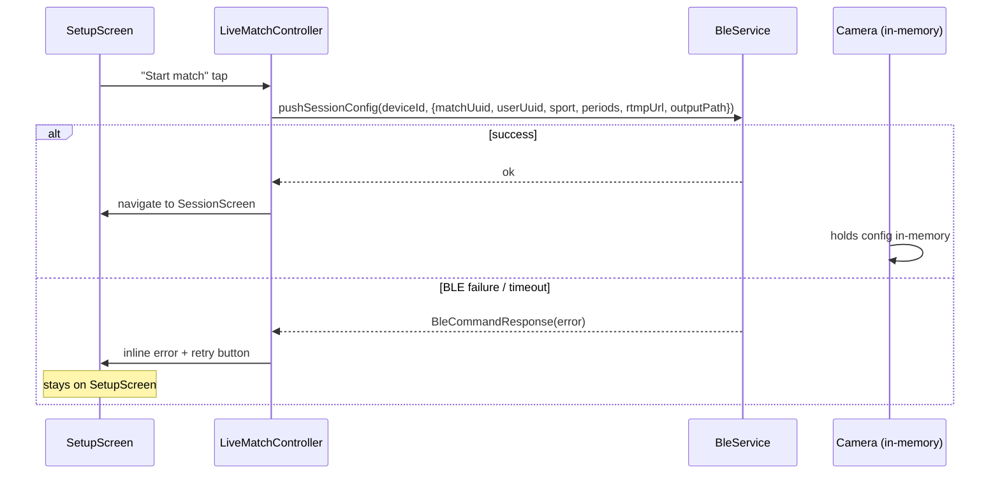

# refactor: App as Source of Truth (Drift SQLite Migration)

## Summary

Migrate all business data (users, teams, matches, sport presets, streaming destinations, clips) from the BLE camera into a local Drift SQLite database on the phone. The camera becomes a stateless executor that receives session config via a new `pushSessionConfig` BLE call and forgets everything when the session ends. `BleService` loses ~20 CRUD methods; six Riverpod controllers switch from BLE-pull to Drift watch-stream pattern, eliminating `_refresh()` calls. `DevDataStore` is deleted; test isolation uses a Drift in-memory DB. Settings gains a Backup/Restore section for multi-phone support.

---

## Problem Frame

Today the camera owns all business data (teams, users, presets, streaming destinations). The app is a thin BLE CRUD client with no local persistence beyond the last-connected camera ID. Data is inaccessible without a camera connection; switching phones requires manual re-entry; there is no offline browse or historical data. `drift` and `sqlite3_flutter_libs` are already in `pubspec.yaml` but completely unused. This plan builds the local DB layer the brainstorm locked in.

---

## Requirements

- R1. All user, team, match, sport-preset, and streaming-destination data persists in a local Drift SQLite DB — accessible without a camera connection.
- R2. No data provider in `lib/state/` requires `activeCameraIdProvider` for reads after this refactor.
- R3. Camera receives everything it needs to execute a session (match UUID, sport config, streaming keys, output paths) via a single `pushSessionConfig` BLE call before recording starts.
- R4. Camera never writes back to the app DB — files are its only output.
- R5. Backup exports the full app DB to a dated local JSON file; restore imports it atomically.
- R6. Restore validates the backup's camera `device_id` against the currently connected camera before importing.
- R7. All existing tests continue to pass; test isolation uses a Drift in-memory DB instead of `DevDataStore`.

---

## Scope Boundaries

- No cloud sync, server-side anything, or device DB mirror.
- No `manifest.json` on device — eliminated; session metadata lives in the app DB.
- Recording file download via WiFi Direct unchanged.
- No app-upgrade migration wizard for existing installs (fresh-start assumption — see Deferred).
- No file-sharing integration for backup export (v1 writes to app documents directory only).

### Deferred to Follow-Up Work

- **Clip ingestion from camera**: Wiring `listRecordings()` → Drift clips/thumbnails tables after session end. Blocked on firmware contract confirming clip UUID echo-back.
- **File-sharing for backup export**: `share_plus` / SAF integration so users can move backup files to cloud or another phone.
- **App-upgrade banner**: Informational one-time toast for installs that had data on the camera side.
- **Mid-session camera disconnect recovery**: Re-push `pushSessionConfig` on BLE reconnect. Out of scope v1.

---

## Context & Research

### Relevant Code and Patterns

- `lib/ble/dev_data_store.dart` — source of all seeding data, built-in preset IDs, cascade semantics, and the `builtIn` guard logic to replicate in Drift DAOs.
- `lib/state/app_data.dart` (~990 lines) — all six controllers using `AsyncNotifier + _refresh()` to replace with Drift watch-stream pattern.
- `lib/ble/ble_service.dart` lines 97–208 — the 20 CRUD methods to remove.
- `lib/ble/ble_service_impl.dart` lines 396–508 — `kAppEnv.isMock` gates around CRUD stubs to delete.
- `lib/state/last_camera.dart` — the SharedPreferences `AsyncNotifier` pattern to mirror for active-user persistence.
- `lib/pages/settings_page.dart` — two render branches (connected full view / `_ConnectCameraEmptyState`); Backup/Restore must render in both.
- `test/test_helpers.dart` — `useDevDataStoreReset()` harness to replace with in-memory Drift equivalent.
- `proto/bluetooth.proto` line 163 — `DeviceInfoResponse` with `device_id` field confirmed present.

### Institutional Learnings

- `docs/plans/2026-05-05-001-feat-settings-page-reshape-plan.md` — established the `activeUserProvider` single-source rule: service call first, then provider update. In the Drift world this ordering applies only to BLE-facing operations; Drift writes update state via watch streams automatically.
- Cascade-delete contract (users → teams, team_matches, sport_presets, streaming_destinations; teams → players, team_matches) must be DB-level FK cascade, not manual code. `DevDataStore.deleteUser` is the spec.
- All filter providers (`sportPresetsFilterProvider`, `teamsSportFilterProvider`, etc.) live in `app_data.dart`, not page files.
- `closeStreamsSynchronously: true` is required in widget test DB construction to avoid lingering timer failures.
- `Value.absent()` ≠ `Value(null)` in Drift companions: absent skips the column in UPDATE; null sets it to NULL.

### External References

- Drift 2.20 docs — table definitions, DAOs, migrations, in-memory testing, TypeConverter patterns.
- Riverpod 2.6 + Drift — `Provider<AppDatabase>` (sync; `LazyDatabase` defers async open); `StreamProvider.family` backed by `dao.watchForUser()` for reactive reads.

---

## Key Technical Decisions

- **Drift DB as sync `Provider<AppDatabase>`**: `LazyDatabase` + `NativeDatabase.createInBackground` defers the file open to the first query. `AppDatabase` constructs synchronously; `ref.onDispose(db.close)` handles cleanup. Controllers in `AsyncNotifier.build()` await queries naturally.
- **Watch-stream pattern**: Controllers switch from `AsyncNotifier + _refresh()` to `StreamProvider.family` backed by `dao.watchForUser(userId)`. Drift emits on every mutation; Riverpod rebuilds automatically. No `_refresh()` calls.
- **Active user in SharedPreferences**: Consistent with `lastConnectedDeviceIdProvider`. `UsersController.build()` reads `active_user_id` from SharedPreferences and sets `activeUserProvider` on startup. First user auto-activates on creation.
- **Built-in presets seeded per-user at creation**: `UsersController.create()` calls `sportPresetsDao.seedBuiltInsForUser(userId)` — same semantics as current `DevDataStore._builtInSportPresets()`.
- **StreamingConfig as flat nullable columns**: `config_type TEXT` (`rtmp`|`rtsp`) + `config_url`, `config_stream_key?`, `config_username?`, `config_password?`. Dart 3 exhaustive `switch` on `configType` reconstructs the sealed class. No JSON parsing.
- **Restore inside `db.transaction()`**: Full DELETE + INSERT runs atomically. Any failure rolls back to pre-restore state — no partial corruption.
- **Export without camera**: Backup can be exported at any time. If camera is connected, `device_id` is included; if not, `device.uuid` is null. Restore with a null backup UUID shows a warning but is not hard-blocked.
- **`pushSessionConfig` failure = block + retry**: If the BLE push fails, the app stays on the Setup screen with an inline error and retry button. Optimistic session entry is disallowed.
- **`upcomingMatchesProvider` device-gate removed**: After migration this provider reads from Drift directly. The `activeCameraIdProvider` watch is eliminated — an explicit fix for an otherwise-silent regression.
- **`DevDataStore` deleted in U8**: Removed entirely once all controllers and tests are migrated.

---

## Open Questions

### Resolved During Planning

- DB init async safety: `LazyDatabase` + `AsyncNotifier.build()` handles this without a gateway `FutureProvider<AppDatabase>`.
- Restore must be transactional: confirmed.
- Active user storage: SharedPreferences (consistent with existing pattern).
- Read pattern: Drift watch streams (Riverpod auto-rebuilds on mutation).

### Deferred to Implementation

- **`device_id` stability**: `DeviceInfoResponse.device_id` exists in proto. Whether it is a stable hardware UUID or the advertising ID requires firmware confirmation. Add a code comment at the restore UUID-check site noting this assumption.
- **Clip UUID contract**: App-generated clip UUIDs pushed in `pushSessionConfig` must be echoed back by `listRecordings()`. Firmware contract not confirmed. Do not implement clip ingestion until confirmed.
- **Riverpod 2.6 stream-notifier mechanism**: Confirm whether `StreamProvider.family` + separate write Notifier or `AsyncNotifier.build()` with a stream listener best fits the existing controller shapes. Document the choice in a code comment.

---

## Output Structure

    lib/
      db/
        app_database.dart          @DriftDatabase class, migration, production constructor
        app_database.g.dart        (generated — match project's convention for proto/*.g.dart)
        tables/
          users_table.dart
          teams_table.dart         TeamsTable + PlayersTable
          team_matches_table.dart
          sport_presets_table.dart
          streaming_destinations_table.dart
          clips_table.dart
          thumbnails_table.dart
        daos/
          users_dao.dart
          teams_dao.dart
          sport_presets_dao.dart
          streaming_destinations_dao.dart
      services/
        backup_service.dart
      state/
        db_providers.dart          appDatabaseProvider + per-DAO providers
    test/
      db/
        users_dao_test.dart
        teams_dao_test.dart
        sport_presets_dao_test.dart
        streaming_destinations_dao_test.dart
      services/
        backup_service_test.dart

---

## High-Level Technical Design

> *This illustrates the intended approach and is directional guidance for review, not implementation specification.*

### Before / After Ownership

### Drift Schema (ERD)

### Session Push Flow

---

## Implementation Units

### Phase 1: Data Foundation

- U1. **Drift schema and DAOs**

**Goal:** Define all Drift tables, DAOs, the `AppDatabase` class, and code-generation setup. Everything else in this plan depends on this foundation.

**Requirements:** R1, R7

**Dependencies:** None

**Files:**
- Create: `lib/db/app_database.dart`
- Create: `lib/db/tables/users_table.dart`
- Create: `lib/db/tables/teams_table.dart` (includes `PlayersTable`)
- Create: `lib/db/tables/team_matches_table.dart`
- Create: `lib/db/tables/sport_presets_table.dart`
- Create: `lib/db/tables/streaming_destinations_table.dart`
- Create: `lib/db/tables/clips_table.dart`
- Create: `lib/db/tables/thumbnails_table.dart`
- Create: `lib/db/daos/users_dao.dart`
- Create: `lib/db/daos/teams_dao.dart`
- Create: `lib/db/daos/sport_presets_dao.dart`
- Create: `lib/db/daos/streaming_destinations_dao.dart`
- Create: `build.yaml` (project root — Drift generation options)
- Modify: `justfile` — add `gen-db` recipe
- Test: `test/db/users_dao_test.dart`
- Test: `test/db/teams_dao_test.dart`
- Test: `test/db/sport_presets_dao_test.dart`
- Test: `test/db/streaming_destinations_dao_test.dart`

**Approach:**
- `AppDatabase` extends `_$AppDatabase`, `schemaVersion = 1`. Production constructor uses `LazyDatabase` + `NativeDatabase.createInBackground`. Named `.forTesting(QueryExecutor)` constructor for tests.
- `onCreate` migration: `m.createAll()` only — no global seeds. Built-in presets are seeded per-user at creation time (U4).
- All `userId`-bearing tables declare `references(usersTable, onDelete: KeyAction.cascade)`. `TeamsTable` references `usersTable` with cascade; `PlayersTable` and `TeamMatchesTable` reference `TeamsTable` with cascade.
- `TeamsTable` and `PlayersTable` live in the same file — they are always co-accessed.
- `StreamingDestinationsTable` flat-column config: `config_type TEXT`, `config_url TEXT`, `config_stream_key TEXT?`, `config_username TEXT?`, `config_password TEXT?`. A `configFromRow(row)` helper in the DAO reconstructs the `StreamingConfig` sealed class via a Dart 3 exhaustive `switch` on `configType`.
- Each DAO exposes: `watchForUser(userId)` stream, `getForUser(userId)` one-shot, `insert`, `update`, `deleteById`. `TeamsDao` additionally exposes player CRUD and `watchTeamMatches(teamId)` stream.
- `SportPresetsDao` exposes `seedBuiltInsForUser(userId)` — inserts the same preset set that `DevDataStore._builtInSportPresets()` currently generates (same IDs, names, sport values).
- `build.yaml` sets `skip_verification_code: true` and `store_date_time_values_as_text: true`.
- Decide in this unit whether `*.g.dart` files are committed (mirrors `lib/models/proto/` convention) and document in `CLAUDE.md`.

**Patterns to follow:**
- `lib/ble/dev_data_store.dart` — exact built-in preset IDs and seeding data.
- Drift 2.20 table + DAO pattern from external research.

**Test scenarios:**
- Happy path: insert a user → `watchAll()` emits the user.
- Happy path: insert a team + player → `watchForUser(userId)` emits team with populated roster.
- Edge case: `watchForUser(userId)` with no rows emits an empty list, not an error.
- Cascade: delete a user → teams, sport_presets, streaming_destinations rows gone.
- Cascade: delete a team → players and team_matches rows gone.
- Happy path: RTMP `StreamingDestination` round-trip — `configFromRow()` returns `RtmpConfig(url, streamKey)`.
- Happy path: RTSP round-trip — `configFromRow()` returns `RtspConfig(url, username?, password?)`.
- Edge case: `configFromRow()` with unknown `configType` throws `StateError`.
- Test setup pattern: each file uses `AppDatabase.forTesting(DatabaseConnection(NativeDatabase.memory(), closeStreamsSynchronously: true))` in `setUp`, `db.close()` in `tearDown`.

**Verification:**
- `just gen-db` completes without error.
- `just analyze` reports no issues in `lib/db/`.
- All new DAO tests pass under `just test`.

---

- U2. **Riverpod DB and DAO providers**

**Goal:** Expose `AppDatabase` and each DAO as Riverpod providers so controllers and services can watch them without knowing the DB constructor.

**Requirements:** R1

**Dependencies:** U1

**Files:**
- Create: `lib/state/db_providers.dart`

**Approach:**
- `appDatabaseProvider = Provider<AppDatabase>((ref) { final db = AppDatabase(); ref.onDispose(db.close); return db; })` — sync construction; `LazyDatabase` handles async open on first query.
- One `Provider<XDao>` per DAO, each reading from `appDatabaseProvider` (e.g., `usersDaoProvider`, `teamsDaoProvider`, `sportPresetsDaoProvider`, `streamingDestinationsDaoProvider`).
- In tests, `ProviderScope(overrides: [appDatabaseProvider.overrideWithValue(AppDatabase.forTesting(...))])` — mirrors how `bleServiceProvider` is currently overridden.

**Patterns to follow:**
- `lib/state/ble_providers.dart` — `bleServiceProvider` singleton pattern.

**Test scenarios:**
- Test expectation: none — pure provider wiring, tested transitively by U4–U7.

**Verification:**
- `lib/state/db_providers.dart` compiles; `just analyze` clean.

---

- U3. **Test harness replacement**

**Goal:** Replace `useDevDataStoreReset()` with a Drift in-memory equivalent. All widget and integration tests continue to pass with the new harness.

**Requirements:** R7

**Dependencies:** U1, U2

**Files:**
- Modify: `test/test_helpers.dart`
- Modify: `test/ble/dev_data_store_test.dart` — delete (behavior now covered by U1 DAO tests)
- Modify: `test/ble/mock_ble_service_test.dart` — remove `useDevDataStoreReset()`, add `useInMemoryDb()`
- Modify: `test/state/active_user_providers_test.dart` — same
- Modify: all `test/pages/*_test.dart` files that call `useDevDataStoreReset()` — update harness

**Approach:**
- `test_helpers.dart` exports `useInMemoryDb()`: registers `setUp`/`tearDown` pair. `setUp` creates `AppDatabase.forTesting(DatabaseConnection(NativeDatabase.memory(), closeStreamsSynchronously: true))` and seeds the same data `DevDataStore._seed()` provides today (user-1 "Coach Diego" active, user-2 "Coach Maria", 4 teams, 5 team_matches under user-1, 7 built-in presets per user via `seedBuiltInsForUser`, empty streaming destinations). `tearDown` calls `db.close()`.
- `useInMemoryDb()` returns the `AppDatabase` instance so tests can add custom rows.
- Every `_buildHarness(...)` factory in test files replaces `bleServiceProvider` CRUD overrides with `appDatabaseProvider.overrideWithValue(db)`.
- `SharedPreferences.setMockInitialValues({'active_user_id': 'user-1'})` replaces the camera-side active-user seed where tests need it.

**Execution note:** Update `test/ble/dev_data_store_test.dart` (delete) and `test/state/active_user_providers_test.dart` (update) first as proof-of-concept before touching page test files.

**Patterns to follow:**
- `test/test_helpers.dart` — existing `useDevDataStoreReset()` structure.
- `test/ble/dev_data_store_test.dart` — the exact seed data to replicate.

**Test scenarios:**
- Happy path: `useInMemoryDb()` in a test → seed data accessible via DAO → correct rows returned.
- Isolation: two sequential tests via `useInMemoryDb()` see independent databases (fresh `setUp` each time).
- Integration: `just test` passes with zero new failures after harness replacement.

**Verification:**
- `grep -rn "useDevDataStoreReset\|DevDataStore" test/` returns zero hits.
- `just test` passes.

---

### Phase 2: Controller Migration

- U4. **UsersController → Drift (+ active user persistence)**

**Goal:** Decouple `UsersController` and `StreamingDestinationsController` from `BleService`. Persist the active user in SharedPreferences. Seed built-in presets on user creation.

**Requirements:** R1, R2

**Dependencies:** U1, U2, U3

**Files:**
- Modify: `lib/state/app_data.dart` — `UsersController`, `StreamingDestinationsController`
- Test: `test/state/active_user_providers_test.dart`
- Test: `test/pages/manage_users_page_test.dart`
- Test: `test/pages/user_form_sheet_test.dart`
- Test: `test/pages/streaming_destination_form_sheet_test.dart`

**Approach:**
- `UsersController.build()`: reads `active_user_id` from SharedPreferences (`prefs.getString('active_user_id')`) and sets `activeUserProvider` if non-null. Because `AsyncNotifier<List<T>>.build()` must return `FutureOr<T>` (not a `Stream`), the pattern is: call `usersDao.getAll()` for the initial list, then subscribe to `usersDao.watchAll()` (skipping the first emission to avoid a double-load), and push each subsequent emission into `state = AsyncValue.data(...)` inside a listener. Cancel the subscription via `ref.onDispose`. This eliminates `_refresh()` while keeping `AsyncNotifier` for write methods.
- `UsersController.create(name)`: inserts user via DAO; calls `sportPresetsDao.seedBuiltInsForUser(userId)`; if `activeUserProvider == null` (first user), sets it and writes to SharedPreferences.
- `UsersController.setActive(userId)`: sets `activeUserProvider` + writes `active_user_id` to SharedPreferences. No BleService call.
- `UsersController.delete(userId)`: pre-checks unchanged (not active, ≥1 remains, no live match) → `usersDao.deleteById(userId)`. FK cascade handles all four downstream collections.
- `StreamingDestinationsController.build()`: watches `activeUserProvider`; returns `streamingDestinationsDao.watchForUser(userId)` stream. Mutations call DAO directly.
- Remove all `activeCameraIdProvider` / `_resolveDeviceId` / `_requireDevice` references from both controllers.

**Patterns to follow:**
- `lib/state/last_camera.dart` — SharedPreferences hydration in `AsyncNotifier.build()`.
- Existing `UsersController` delete guard logic (preserve exactly).

**Test scenarios:**
- Happy path: `create("Alice")` → user appears in stream, becomes active if first user, built-in presets appear in `SportPresetsController`.
- Happy path: `create("Bob")` when a user already exists → Bob appears in stream, `activeUserProvider` unchanged, built-in presets seeded for Bob only.
- Edge case: cold-restart hydration where SharedPreferences contains an `active_user_id` that no longer exists in Drift → controller ignores the stale id and leaves `activeUserProvider` null (or sets it to the first available user).
- Happy path: `setActive(userId)` → `activeUserProvider` updated + SharedPreferences written; cold-restart hydrates the same active user.
- Error: `delete(activeUserId)` → `UsersControllerException`, user not deleted.
- Error: `delete(lastUserId)` when only one user → `UsersControllerException`.
- Error: `delete(userId)` while live match running → `UsersControllerException`.
- Cascade: `delete(userId)` with teams + presets + destinations → all four collections gone from Drift.
- Integration: `StreamingDestinationsController` shows no entries after deleting the owning user.

**Verification:**
- `test/state/active_user_providers_test.dart` and `test/pages/manage_users_page_test.dart` pass.
- Active user survives across controller dispose/rebuild (SharedPrefs hydration verified in tests via `SharedPreferences.setMockInitialValues`).

---

- U5. **TeamsController + upcomingMatchesProvider → Drift**

**Goal:** Decouple `TeamsController` (team CRUD, player CRUD, team match CRUD) from `BleService`. Fix the silent regression in `upcomingMatchesProvider` that returns empty data without a camera connection.

**Requirements:** R1, R2

**Dependencies:** U1, U2, U3, U4

**Files:**
- Modify: `lib/state/app_data.dart` — `TeamsController`, `teamMatchesProvider`, `upcomingMatchesProvider`, `filteredTeamsProvider`
- Test: `test/integration/main_page_test.dart`
- Test: `test/integration/settings_page_test.dart`

**Approach:**
- `TeamsController.build()` → `teamsDao.watchForUser(userId)` stream.
- All CRUD methods (`create`, `edit`, `delete`, `setHidden`, `addPlayer`, `updatePlayer`, `removePlayer`, `addMatch`, `removeMatch`) call DAO directly; no `_refresh()`.
- `teamMatchesProvider(teamId)` → `teamsDao.watchTeamMatches(teamId)` stream.
- `upcomingMatchesProvider`: remove `activeCameraIdProvider` watch entirely. Convert to a `StreamProvider` backed by a Drift join query across `teams` + `team_matches` filtered by `kind = upcoming` AND `hidden = false` for the active user. Remove the explicit `ref.invalidate(upcomingMatchesProvider)` calls from `TeamsController` mutations — the stream emits automatically on DB writes.
- `filteredTeamsProvider` derives from `TeamsController` stream; no device dependency remains.

**Test scenarios:**
- Happy path: `create(TeamDraft)` → team appears in stream; `filteredTeamsProvider` updates.
- Happy path: `addPlayer(teamId, draft)` → team's roster updates in the stream.
- Happy path: `upcomingMatchesProvider` returns matches when `activeCameraIdProvider == null`.
- Edge case: `upcomingMatchesProvider` returns empty list when active user has no teams.
- Edge case: hidden teams excluded from `upcomingMatchesProvider`.
- Cascade: `delete(teamId)` → players and team_matches gone; `upcomingMatchesProvider` no longer includes deleted team.

**Verification:**
- `upcomingMatchesProvider` returns data in tests where `activeCameraIdProvider` is null.
- `just test` passes including integration tests.

---

- U6. **SportPresetsController → Drift**

**Goal:** Decouple `SportPresetsController` from `BleService`. Preserve the `builtIn` guard.

**Requirements:** R1, R2

**Dependencies:** U1, U2, U3, U4

**Files:**
- Modify: `lib/state/app_data.dart` — `SportPresetsController`, `sportPresetsForSportProvider`
- Test: `test/pages/sport_presets_built_in_test.dart`

**Approach:**
- `SportPresetsController.build()` → `sportPresetsDao.watchForUser(userId)` stream (returns both built-ins and user-created for that user).
- `create/edit()` → DAO insert/update.
- `delete(id)`: guard — if `preset.builtIn == true` throw (mirrors `DevDataStore` line 358 guard). Otherwise `sportPresetsDao.deleteById(id)`.
- `edit(id, draft)`: same guard — if the target preset has `builtIn == true` throw before calling the DAO (mirrors the DevDataStore update guard).
- `sportPresetsForSportProvider(sport)` → derived from controller stream filtered by sport. No device dependency.

**Test scenarios:**
- Happy path: create a custom preset → appears in stream.
- Error: delete a built-in preset → exception thrown, preset not deleted.
- Error: edit a built-in preset → exception thrown, preset not updated.
- Happy path: `sportPresetsForSportProvider("soccer")` returns only soccer presets.
- Integration: new user creation (U4) seeds built-in presets; they appear in `SportPresetsController` stream.

**Verification:**
- `test/pages/sport_presets_built_in_test.dart` passes.
- `just test` clean.

---

- U7. **Remove device gates from all data providers**

**Goal:** Final sweep to confirm no data provider still requires `activeCameraIdProvider`. Remove `_resolveDeviceId`, `_requireDevice`, and `if (id == null) return []` guards from all migrated controllers.

**Requirements:** R2

**Dependencies:** U4, U5, U6

**Files:**
- Modify: `lib/state/app_data.dart` — remove device-gate helpers from data controllers; retain them in `LiveMatchController` and `liveMatchProvider` where camera connection is still required.

**Approach:**
- Search for all uses of `_resolveDeviceId` and `_requireDevice` in data controller methods; remove each one.
- Retain device guards in `LiveMatchController` (session/BLE-bound) and in `recordingsProvider` (camera-side data).

**Test scenarios:**
- Integration: Teams, Match Setup, Streaming, and User sections all load data in tests where `activeCameraIdProvider` is not set.

**Verification:**
- `grep -rn "_resolveDeviceId\|_requireDevice" lib/state/app_data.dart` returns zero hits outside of BLE-bound sections (`LiveMatchController`).
- `just test` passes.

---

### Phase 3: BleService Slim-Down

- U8. **Remove CRUD methods from BleService + delete DevDataStore**

**Goal:** Strip the ~20 CRUD methods from `BleService`, `MockBleService`, and `BleServiceImpl`. Delete `DevDataStore`. Clean the corresponding proto command types.

**Requirements:** R1 (camera CRUD methods obsolete once app owns data)

**Dependencies:** U4, U5, U6, U7

**Files:**
- Modify: `lib/ble/ble_service.dart` — remove: `listTeams`, `createTeam`, `updateTeam`, `deleteTeam`, `setTeamHidden`, `addPlayer`, `updatePlayer`, `removePlayer`, `addTeamMatch`, `removeTeamMatch`, `listTeamMatches`, `listSportPresets`, `createSportPreset`, `updateSportPreset`, `deleteSportPreset`, `listStreamingDestinations`, `createStreamingDestination`, `updateStreamingDestination`, `deleteStreamingDestination`, `listUsers`, `createUser`, `updateUser`, `deleteUser`, `getActiveUser`, `setActiveUser`
- Modify: `lib/ble/mock_ble_service.dart` — remove the same methods and all `DevDataStore.instance.*` calls
- Modify: `lib/ble/ble_service_impl.dart` — remove the same methods and `kAppEnv.isMock` gates around them
- Delete: `lib/ble/dev_data_store.dart`
- Delete: `test/ble/ble_service_impl_dev_methods_test.dart` — tests CRUD methods that no longer exist
- Modify: `proto/bluetooth.proto` — remove CRUD command/response message types; preserve `GetDeviceInfoCommand` / `DeviceInfoResponse`
- Modify: `lib/models/command.dart` — remove ~20 `BleCommand` sealed subclasses

**Approach:**
- Start with the abstract interface; let the compiler cascade failures to `MockBleService` and `BleServiceImpl` — address each in turn.
- After deleting `dev_data_store.dart`, run `just analyze` to catch remaining import sites.

**Test scenarios:**
- Test expectation: none for new behavior — this is pure deletion. Compiler + test suite validate correctness.

**Verification:**
- `grep -rn "DevDataStore\|listTeams\|createTeam\|listUsers\|createUser\|listSportPresets\|listStreamingDestinations" lib/` returns zero hits.
- `just ci` passes (format-check + analyze + test).

---

- U9. **Add pushSessionConfig to BleService and proto**

**Goal:** Add the new `pushSessionConfig` BLE call. Wire it into the match Setup screen as a required step before entering the session.

**Requirements:** R3, R4

**Dependencies:** U8

**Files:**
- Modify: `proto/bluetooth.proto` — add `PushSessionConfigCommand` message with fields: `match_uuid`, `user_uuid`, `sport` (enum), `num_periods`, `period_length_seconds`, `rtmp_url` (optional), `stream_key` (optional), `video_output_path`, `thumbnail_output_path`
- Modify: `lib/models/command.dart` — add `PushSessionConfigCommand` sealed subclass with same fields
- Modify: `lib/ble/ble_service.dart` — add `Future<BleCommandResponse<void>> pushSessionConfig(String deviceId, PushSessionConfig config)`
- Modify: `lib/ble/mock_ble_service.dart` — add stub; store `lastPushedConfig` for test assertions
- Modify: `lib/ble/ble_service_impl.dart` — add stub with `UnimplementedError("Phase 7: pushSessionConfig")`
- Modify: `lib/pages/match_page.dart` — `_SetupScreen` "Start match" button: call `pushSessionConfig` before `liveMatch.startPeriod()`; on failure show inline error + retry; on success navigate
- Modify: `lib/state/app_data.dart` or `lib/pages/match_page.dart` — compute output path from `'/data/video/{userUuid}/{matchUuid}/'` template

**Approach:**
- `PushSessionConfig` is a plain Dart model (not a BleCommand subclass) holding the session payload. `pushSessionConfig(deviceId, config)` wraps it in a `PushSessionConfigCommand`.
- "Start match" tap becomes async: show loading indicator during push; handle `BleTimeoutException` and `BleConnectionException` with inline error message and a "Retry" button — do NOT navigate on error.
- Output paths: `videoOutputPath = '/data/video/{userUuid}/{matchUuid}/'`, `thumbnailOutputPath = '/data/thumbnail/{userUuid}/{matchUuid}/'`.

**Test scenarios:**
- Happy path: `pushSessionConfig` succeeds → `startPeriod()` called, session screen entered.
- Error: `pushSessionConfig` throws `BleTimeoutException` → inline error shown, setup screen remains, `startPeriod()` not called.
- Error: `pushSessionConfig` throws `BleConnectionException` → same.
- Happy path: output paths computed correctly from known user and match UUIDs.
- Integration: `MockBleService.lastPushedConfig` has correct `matchUuid`, `sport`, `numPeriods` after a "Start match" tap in widget test.

**Verification:**
- `just test` passes including integration tests that exercise the match setup flow.

---

### Phase 4: Backup / Restore

- U10. **BackupService — export**

**Goal:** Implement `BackupService.export()`: reads all Drift tables, optionally fetches the camera's `device_id` via BLE, serializes to the backup JSON schema, writes to the app documents directory.

**Requirements:** R5

**Dependencies:** U1, U2, U8

**Files:**
- Create: `lib/services/backup_service.dart`
- Test: `test/services/backup_service_test.dart`

**Approach:**
- `BackupService(AppDatabase db, {BleService? ble})`.
- `export({String? deviceId})`: one-shot DAO reads of all eight owned tables. If `ble` + `deviceId` provided, sends `GetDeviceInfoCommand` to read `device_id`; on any failure, `device.uuid = null` (export proceeds). Serializes to backup JSON schema from the requirements doc. Writes to `getApplicationDocumentsDirectory()` as `sst-backup-YYYY-MM-DD.json`. Returns the written file path.
- All model classes need `toJson()` — add where missing (or implement serialization inside `BackupService`).

**Test scenarios:**
- Happy path: export with seeded DB and no BLE → valid JSON, `device.uuid == null`.
- Happy path: export with BLE mock providing `device_id` → `device.uuid` populated.
- Happy path: exported JSON parses correctly against the backup schema.
- Edge case: export with empty DB → valid JSON with empty arrays.
- Edge case: `GetDeviceInfo` BLE call throws → export succeeds with `device.uuid = null`.

**Verification:**
- `test/services/backup_service_test.dart` passes.
- Exported JSON structure matches schema in `docs/brainstorms/app-as-source-of-truth-requirements.md`.

---

- U11. **BackupService — import (restore)**

**Goal:** Implement `BackupService.import()`: validate the backup file, validate `device_id` if present, atomically replace all Drift data.

**Requirements:** R5, R6

**Dependencies:** U10

**Files:**
- Modify: `lib/services/backup_service.dart` — add `import()` method
- Modify: `test/services/backup_service_test.dart` — add import test cases

**Approach:**
- `import(File file, {String? currentCameraDeviceId})`:
  1. Parse JSON; throw `BackupImportException("malformed JSON")` on failure.
  2. Check `backup_version == 1`; throw `BackupImportException("unsupported backup version: X")` otherwise.
  3. If `backup.device.uuid != null && currentCameraDeviceId != null`: compare; throw `BackupImportException("backup is for a different camera")` on mismatch.
  4. Run inside `db.transaction()`: delete all rows from all owned tables (FK order: thumbnails, clips, team_matches, players, teams, sport_presets, streaming_destinations, users); bulk-insert all backup rows via `batch()`.
  5. Return the first user ID from the restored data so callers can update `activeUserProvider`.
- Add `fromJson()` to all model classes where missing.

**Test scenarios:**
- Happy path: valid backup → all rows in Drift match backup contents after import.
- Atomicity: seed the in-memory DB with known rows (separate transaction before calling `import()`), then call `import()` with a backup file that contains a deliberately corrupt row; verify the DB still contains the original seed rows after the failed import.
- Error: malformed JSON → `BackupImportException`, DB unchanged.
- Error: `backup_version = 2` → `BackupImportException`, DB unchanged.
- Error: UUID mismatch → `BackupImportException`, DB unchanged.
- Edge case: `backup.device.uuid = null` with non-null `currentCameraDeviceId` → import proceeds (no UUID check when backup UUID is absent).
- Edge case: both `backup.device.uuid` and `currentCameraDeviceId` are null → import proceeds without UUID validation.
- Edge case: empty backup (no users) → succeeds, DB is empty.

**Verification:**
- All import test scenarios pass.
- Rollback test: corrupt backup leaves seed data intact.

---

- U12. **Backup/Restore UI and Settings gate fix**

**Goal:** Add the Backup/Restore section to Settings, always visible regardless of camera connection. Invalidate all data providers after a successful restore.

**Requirements:** R5, R6

**Dependencies:** U10, U11, U2

**Files:**
- Modify: `lib/pages/settings_page.dart`
- Test: `test/pages/settings_backup_restore_test.dart`

**Approach:**
- `SettingsPage` currently does an early-return to `_ConnectCameraEmptyState` (a full `Scaffold`) when disconnected. Restructure: the outer `SettingsPage.build()` returns a single `Scaffold` whose body is a `Column` containing (a) the connection-gated content (either the connected `ListView` or a compact `_ConnectCameraBanner` widget — no longer a full-Scaffold early-return) and (b) `_DataSection` unconditionally below it. `_ConnectCameraEmptyState` is converted from a full-Scaffold page to a slim banner widget that fits inside the shared `Scaffold` body.
- `_DataSection` contains:
  - "Export backup" nav row → calls `BackupService.export()`; shows a snackbar with the filename on success; error snackbar on failure.
  - "Restore backup" nav row → shows a confirmation dialog ("This will replace all your data. Continue?") → file path input or simple picker → calls `BackupService.import()`.
- Camera UUID for restore: if `activeCameraIdProvider != null`, send `GetDeviceInfoCommand` for `device_id`; otherwise pass null to `import()`.
- After successful import: `ref.invalidate()` on `usersControllerProvider`, `teamsControllerProvider`, `sportPresetsControllerProvider`, `streamingDestinationsControllerProvider`, `upcomingMatchesProvider`; set `activeUserProvider` to the first restored user; write to SharedPreferences.
- `BackupImportException` messages surface as error snackbars (no crash).

**Patterns to follow:**
- `lib/pages/settings_page.dart` — `WfSection` + nav row pattern; existing error snackbar pattern.

**Test scenarios:**
- Happy path: "Export backup" tap → `BackupService.export()` called → success snackbar.
- Error: `BackupService.export()` throws → error snackbar shown.
- Happy path: "Restore backup" tap → confirmation dialog appears.
- Happy path: restore with valid file + matching UUID → success, providers invalidated, UI reflects restored data.
- Error: restore with UUID mismatch → `BackupImportException` error snackbar, UI unchanged.
- Regression: `_DataSection` renders when `activeCameraIdProvider == null`.
- Regression: other settings sections (camera info, user management, match setup, streaming) unaffected.

**Verification:**
- `test/pages/settings_backup_restore_test.dart` passes.
- `just test` passes including `test/integration/settings_page_test.dart`.
- Backup/Restore section renders in a test with `activeCameraIdProvider` not set.

---

## Phased Delivery

### Phase 1 — Data Foundation (U1–U3)
Drift schema, providers, and test harness replacement. No user-visible change. Establishes the DB layer and ensures the test suite runs cleanly against Drift in-memory before any controller changes.

### Phase 2 — Controller Migration (U4–U7)
All six data controllers switch from BLE to Drift. Data is accessible without a camera. `upcomingMatchesProvider` device-gate removed. App now reads from local DB; camera CRUD still exists in the interface (removed in Phase 3).

### Phase 3 — BleService Slim-Down (U8–U9)
Remove ~20 dead CRUD methods and `DevDataStore`. Add `pushSessionConfig`. Camera integration is now push-only. Interface reflects the new architecture.

### Phase 4 — Backup / Restore (U10–U12)
Full backup/restore capability in Settings. Multi-phone scenario unblocked.

---

## System-Wide Impact

- **Interaction graph**: All six data controllers decouple from `bleServiceProvider`. Riverpod rebuilds are now triggered by Drift watch streams, not BLE responses. `wifiHandoffProvider` (BLE connect → WiFi group) is unaffected.
- **Error propagation**: Drift errors surface as `AsyncValue.error` in stream providers. The existing `when(error: ...)` handling in UI widgets handles both BLE and Drift errors identically.
- **State lifecycle risks**: `activeUserProvider` must be hydrated from SharedPreferences before controllers emit meaningful data. Brief null state on cold start produces empty lists — same behavior as today (camera round-trip also took time).
- **API surface parity**: `MockBleService` loses CRUD delegates. All test seeding moves to Drift DAO inserts. Widget test `_buildHarness` factories must add `appDatabaseProvider` override and remove BLE CRUD overrides.
- **Integration coverage**: Full test suite runs against in-memory Drift after U3. Isolation guarantees preserved; `DevDataStore` maps replaced by real Drift queries.
- **Unchanged invariants**: WiFi Direct (preview, downloads), BLE discovery/connect/disconnect, telemetry polling, match-state polling, thumbnail requests, and `LiveMatchController` are all unchanged.

---

## Risks & Dependencies

| Risk | Mitigation |
|------|------------|
| Drift `*.g.dart` not in CI | In U1: decide to commit generated files (mirrors `proto/` convention) or add `just gen-db` to `just ci`. |
| `closeStreamsSynchronously: true` omitted in widget tests | Documented in U3; add a comment in `useInMemoryDb()`. |
| `device_id` in proto is advertising ID, not stable hardware UUID | Flagged as deferred; add a code comment at the restore UUID-check site. |
| Enum stored as int — ordering corruption on new variant | Use text columns for all enums throughout (TextColumn + TypeConverter or `textEnum`). |
| Settings page connection gate blocks Backup/Restore | Explicit structural fix in U12; regression test verifies section renders without camera. |
| `upcomingMatchesProvider` silent device-gate regression | Explicit fix in U5; regression test verifies data returned without camera. |
| Riverpod 2.6 stream-notifier mechanism ambiguity | Deferred to implementation (see Open Questions); document choice in a code comment. |

---

## Documentation / Operational Notes

- Add `just gen-db` to `justfile` and document under Commands in `CLAUDE.md`.
- Update `CLAUDE.md` directory layout to include `lib/db/` and `lib/services/`.
- If `*.g.dart` files are committed, note them alongside `lib/models/proto/` in the gitignore section (or commit them together).

---

## Sources & References

- **Origin document:** [docs/brainstorms/app-as-source-of-truth-requirements.md](docs/brainstorms/app-as-source-of-truth-requirements.md)
- Prior plan: [docs/plans/2026-05-05-001-feat-settings-page-reshape-plan.md](docs/plans/2026-05-05-001-feat-settings-page-reshape-plan.md)
- Drift 2.20 docs — https://drift.simonbinder.eu
- `lib/ble/dev_data_store.dart` — seeding source of truth for U1/U3
- `lib/state/last_camera.dart` — SharedPreferences AsyncNotifier pattern for U4
