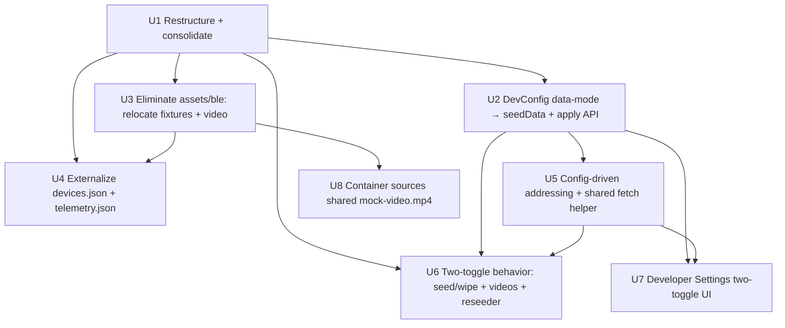
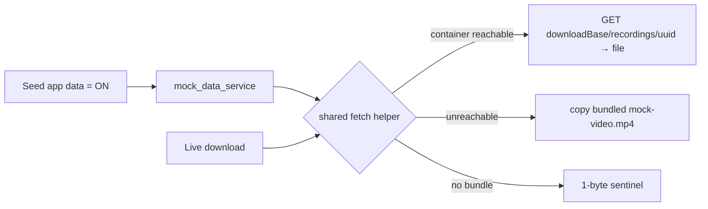

# refactor: Dev data/camera toggles + mock-system fidelity

## Summary

Replace the opaque 3-mode Developer Settings selector with two independent
toggles (Emulate camera / Seed app data), and restructure the mock system so its
layout, data, video, and network addressing mirror the two real data sources. The
implementation lands in 8 units across 4 phases: a `lib/mock` restructure +
`DevConfig` migration, then assets/data externalization, then behavior
(config-driven addressing, container-backed video fetch, seed/wipe), then the UI
and Docker container. A single shared container-fetch helper unifies all video
materialization; telemetry collapses to one JSON baseline; `lib/` asset placement
is primary but gated by a bundling-verification step.

---

## Problem Frame

The current Developer Settings 3-mode selector (Full / Seed only / Empty)
conflates two unrelated concerns and confuses behavior — e.g. choosing "Empty"
then seeing a discoverable camera reads as a bug. In the running code `full` and
`seed` are already identical (both call `MockDataSeeder.seed()`), and camera
emulation is a separate bool, so the "three modes" are really "seed yes/no" plus a
redundant option. Full motivation, the four-combination model, and the fidelity
goals live in the origin requirements doc (see Sources & References).

---

## Requirements

- R1. Two independent toggles replace the 3-mode selector; both default ON. *(origin R1)*
- R2. Camera section owns the toggle + the WiFi base URLs; the toggle governs the camera as a whole (BLE + live WiFi). *(origin R2, R22)*
- R3. Seed section owns its toggle + a description scoping it to phone-local data + on-device videos. *(origin R3)*
- R4. Each toggle/field persists independently; restart-to-apply with active-vs-staged indicator preserved. *(origin R4)*
- R5. `main()` applies the two flags independently: seed on → seed DB + materialize past-match videos; seed off → wipe app data to base + delete on-device videos; camera on/off → advertise + live WiFi. *(origin R5)*
- R6. Camera-reported state (telemetry/storage/temp/recordings list) depends only on the camera toggle. *(origin R6)*
- R7. Seeded videos are fetched from the mock WiFi container over the live HTTP download path, not copied from the bundled asset. *(origin R7)*
- R8. Graceful fallback preserved: container → bundled `mock-video.mp4` → sentinel. *(origin R8)*
- R9. The download base is readable by the seed path regardless of the camera toggle. *(origin R9)*
- R10. The reseed action reflects the seed flag in both directions (add vs remove app data + videos). *(origin R10)*
- R11. `lib/mock/seed/` → `lib/mock/internal/`. *(origin R11)*
- R12. Consolidate `data_mode.dart` + `mock_data_seeder.dart` into one `mock_data_service.dart`. *(origin R12)*
- R13. App-data fixtures are per-feature JSON under `lib/mock/internal/fixtures/`. *(origin R13)*
- R14. `recordings.json` stays emulator-side. *(origin R14)*
- R15. Externalize `_fakeDevices` → `devices.json` with in-code fallback. *(origin R15)*
- R16. Externalize telemetry baseline → `telemetry.json` feeding both telemetry builders; drift stays in code; in-code fallback. *(origin R16)*
- R16a. `MockWifiService` gets no JSON fixture. *(origin R16a)*
- R17. Eliminate `assets/ble/`; relocate fixtures + video; update `pubspec.yaml`. *(origin R17)*
- R18. `mock-video.mp4` at `lib/mock/emulator/`, single canonical video. *(origin R18)*
- R19. Container sources the video via mount; drop the `video-gen` stage. *(origin R19)*
- R20. RTSP preview source must be H.264/`-c copy`-compatible, else re-encode. *(origin R20)*
- R21. Migrate `dev_config_data_mode` → `seedData` bool. *(origin R21)*
- R22. Two base-URL fields (preview + download) replace the single host. *(origin R22)*
- R23. No hardcoded ports/schemes in the mock data plane; derive URLs from the two bases. *(origin R23)*
- R24. Migrate `dev_config_server_address` host → the two base URLs. *(origin R24)*
- R25. Addressing change is mock/dev only; production `WifiServiceImpl`/`WifiDirectGroup` unchanged. *(origin R25)*

**Origin acceptance examples:** AE1 (R1,R6), AE2 (R5,R7), AE3 (R5), AE4 (R6), AE5 (R7,R8), AE6 (R11–R16a), AE7 (R17), AE8 (R18,R19), AE9 (R22,R23).

---

## Scope Boundaries

- Per-UUID distinct video content — only one mock video exists; the container returns it for any UUID. Not changing.
- Server-side recording-ID validation — the camera has no DB. Not adding.
- Production `WifiServiceImpl` / `WifiDirectGroup` addressing — mock-only change; two protocols on two ports stays faithful.
- Switching the preview transport to HLS/WebRTC — would lower fidelity vs the real RTSP-over-WiFi-Direct camera.
- Mock service *behavior* (telemetry drift math, download progress curves, timing) — unchanged; only baseline/static data is externalized.
- Compile-time mock exclusion is already handled by the dual-entrypoint pattern (`main.dart` / `main_prod.dart`) — not re-architected here, only preserved.

### Deferred to Follow-Up Work

- Import-lint CI guard rejecting `lib/mock/` imports from production code: separate hardening PR (recommended by the layer-inversion learning, not required for this change).
- `/ce-compound` capture of two new patterns once this lands: assets-under-`lib/` bundling outcome, and config-driven base-URL addressing.

---

## Context & Research

### Relevant Code and Patterns

- `lib/core/config/dev_config.dart` — **`DataMode` enum is defined here (line 8), not in `data_mode.dart`.** Holds `dataMode`/`cameraEmulation`/`serverAddress` with `load()`/`save()`/`copyWith()` and SharedPreferences keys. Migration target.
- `lib/mock/seed/data_mode.dart` — `applyDataMode(db, mode)` + `_wipeToBaseData(db)` (in-place wipe in one transaction, FK order, then `seedBaseData()`).
- `lib/mock/seed/mock_data_seeder.dart` — fixture loader + `_writePlaceholderFile` (one of two video-write sites; `rootBundle.load('assets/ble/mock-video.mp4')`).
- `lib/mock/emulator/mock_ble_service.dart` — `_fakeDevices` static (→ `devices.json`), `recordings.json` loader with `_fallbackRecordings`, and `_makeTelemetry` + `_makeProtoTelemetry` (duplicated baseline → `telemetry.json`).
- `lib/mock/emulator/mock_wifi_service.dart` — `_downloadOrFallback` (container-fetch → bundled → sentinel; the basis for the shared helper) and hardcoded `rtsp://…:8554/preview` (line 137) + `http://…:8080/recordings/…` (line 440).
- `lib/main.dart` — dev wiring: `applyDataMode(db, devConfig.dataMode)`, `MockBleService(advertiseDevices:, serverAddress:)`, `MockWifiService(serverAddress:)`, 6 provider overrides, and `_syncSeedVideosToGallery` (second video-write site, gated on `dataMode != empty`).
- `lib/main_prod.dart` — prod entrypoint; imports **no** `mock/**`. Must stay mock-free.
- `lib/features/settings/developer/developer_settings_page.dart` + `developer_settings_state.dart` — `_ModeChip` row + single `Switch` + server-address `TextField`; `DeveloperSettingsNotifier` (AutoDisposeNotifier) with eager per-edit `save()` + staged/active model.
- `lib/core/services/video_path_service.dart` — `recordingPath(recordingId)` → `<appSupport>/videos/<id>.mp4`.
- `lib/core/models/`: `recording.dart` (`RecordingMetadata`, `DownloadToken`), `wifi.dart` (`WifiDirectGroup` + `previewUrl()`/`downloadBaseUrl()` builders), `telemetry.dart` (`DeviceTelemetry`), `device.dart` (`SstDevice`) — fixture target shapes.
- `.devcontainer/mock-camera-wifi/` — `Dockerfile` (`video-gen` ffmpeg stage → `/srv/sample.mp4`), `supervisord.conf` (mediamtx + `ffmpeg -stream_loop -1 … -c copy` RTSP), `download_server.py` (serves `/srv/sample.mp4`), `mediamtx.yml` (minimal). `docker-compose.yml` maps host `8555→8554`, `8080→8080`.
- Test patterns to mirror: `setUpAll(TestWidgetsFlutterBinding.ensureInitialized)` for `rootBundle`; `_FakePathProvider` mixin (duplicated in `data_mode_test.dart` + `mock_data_seeder_test.dart`); `AppDatabase.forTesting(NativeDatabase.memory())`; `MockBleService` zeroed timing (`randomSeed: 42`); `ProviderScope`/`ProviderContainer` with `overrideWithValue`.

### Institutional Learnings

- `docs/solutions/architecture-patterns/riverpod-drift-db-reset-in-place-2026-05-11.md` — **wipe in-place, never close/reopen** the DB; `ref.invalidate` doesn't work on a plain `Provider`; one `transaction()`, FK order, then public `seedBaseData()`. Governs the seed-off branch.
- `docs/solutions/database-issues/sqlite-filename-rename-data-loss-2026-05-11.md` — migrate, don't silently reset, on renamed keys. Applies to the SharedPreferences `DevConfig` migration.
- `docs/solutions/developer-experience/bool-fromEnvironment-default-tied-to-app-env-2026-05-19.md` — keep dev-on/prod-off-but-overridable defaults; no silent dev-DB emptying.
- `docs/solutions/runtime-errors/mediamtx-source-publisher-crash-on-startup-2026-05-27.md` — keep `mediamtx.yml` minimal (no `source: publisher`); healthcheck must probe 8554, not just 8080; diagnose via `supervisorctl status`.
- `docs/solutions/runtime-errors/vlc-controller-dispose-lateerror-2026-05-27.md` — route VLC controller disposal through the `.catchError`-guarded helper; relevant if base-URL changes trigger preview controller swaps.
- `docs/solutions/conventions/isdevbackend-must-not-bypass-connection-state-guards-2026-05-19.md` — the camera toggle only selects the impl; never bypasses connection-state guards.
- `docs/solutions/database-issues/backup-service-silent-column-omission-on-schema-change-2026-05-19.md` — if any seeded table's shape changes, update `BackupService` export+import+round-trip test together.

### External References

- None. Local patterns are strong across the full stack (Flutter 3.8.1 / Drift 2.20 / Riverpod 2.6 / flutter_blue_plus 1.35 / dio 5.7 / shared_preferences 2.3); external research skipped.

---

## Key Technical Decisions

- **`lib/` assets are primary — verified bundleable.** Place fixtures + `mock-video.mp4` under `lib/mock/.../`, declared in `pubspec.yaml`. A doc-review feasibility probe confirmed (`flutter build bundle`, Flutter 3.41.9) that assets declared under `lib/` are bundled and registered in `AssetManifest.bin`, so the primary path will work. `assets/mock/{emulator,internal}/` remains a documented contingency only if a future toolchain regresses; the implementer should not need it.
- **Two separate `DevConfig` migrations, each landing with its consumer.** The data-mode migration (`dataMode` enum → `seedData` bool) lands in U2 with the bool-based apply API; the addressing migration (`serverAddress` → two base URLs) lands in U5 with the URL-deriving services. This keeps `dev_config.dart` edits paired with the code that consumes them and avoids a broken intermediate state.
- **One shared container-fetch helper.** Factor `MockWifiService._downloadOrFallback` into a single helper used by the live download and both seed-time video sites (`MockDataSeeder._writePlaceholderFile`, `main.dart:_syncSeedVideosToGallery`), so all three exercise the same container → bundled → sentinel path.
- **Single telemetry baseline.** Collapse the duplicated `_makeTelemetry` / `_makeProtoTelemetry` baselines into one `telemetry.json`-backed source; drift math stays in code and is applied on top.
- **Seed-off wipes in place.** Reuse the existing `_wipeToBaseData` in-place transaction pattern (never close the DB) and extend it to delete on-device past-match video files.
- **Container video via volume mount.** The mock-camera-wifi build context (`.devcontainer/mock-camera-wifi/`) cannot `COPY` a repo-root file, so the video is provided by a docker-compose mount onto `/srv/sample.mp4`, and the `video-gen` ffmpeg stage is dropped.

---

## Open Questions

### Resolved During Planning

- *Where does `DataMode` live?* — In `dev_config.dart:8`, not `data_mode.dart`; the enum removal edits `dev_config.dart` directly.
- *How is mock code kept out of prod?* — Dual entrypoints (`main.dart` vs `main_prod.dart`), not conditional imports; only `main.dart` imports `mock/**`. Preserve this.
- *One port or two?* — Two; RTSP + HTTP are distinct protocols matching the real camera. Clean single-domain URLs come from standard ports / reverse proxy on the VM, handled by the two configurable base URLs.
- *Do assets under `lib/` bundle?* — Yes. Verified during doc review with `flutter build bundle` (Flutter 3.41.9): a `lib/`-declared asset was emitted and registered in `AssetManifest.bin`. The `assets/mock/` fallback is a contingency only.
- *`WifiDirectGroup` port reconciliation* — Resolved in U5: keep the group's integer ports as inert default metadata; source live URLs from the base URLs (the preview consumes `previewDescriptor.url`, not `group.previewUrl()`).

### Deferred to Implementation
- **Video codec for RTSP `-c copy`** — `ffprobe` is not installed in the devcontainer; check the codec in U8. If `mock-video.mp4` is not H.264-compatible, switch the preview ffmpeg from `-c copy` to `-c:v libx264 …`.
- **`_syncSeedVideosToGallery` vs `_writePlaceholderFile`** — confirm at implementation whether both sites remain necessary or merge once both route through the shared helper; the gallery-sync purpose needs a code read before deciding.
- **103 MB video impact** — confirm acceptable APK growth and container loop/mount behavior when the canonical video replaces the 10s generated sample.

---

## High-Level Technical Design

> *This illustrates the intended approach and is directional guidance for review, not implementation specification. The implementing agent should treat it as context, not code to reproduce.*

**Unit dependency graph:**

**Two data sources → two toggles (behavioral model, from origin):**

| Emulate camera | Seed app data | Result |
|:---:|:---:|---|
| ON | ON | Full fidelity: discoverable camera + telemetry + seeded data + on-device videos |
| ON | OFF | Camera discoverable, telemetry present; no app data/videos |
| OFF | ON | App data + videos present; no camera |
| OFF | OFF | Empty app, no camera |

**Video materialization after consolidation:**

---

## Implementation Units

### U1. Restructure `lib/mock` and consolidate into `mock_data_service.dart`

**Goal:** Rename `lib/mock/seed/` → `lib/mock/internal/` and fold `data_mode.dart` + `mock_data_seeder.dart` into a single `mock_data_service.dart`, preserving current behavior (no semantic change yet). Update all importers and relocate the affected tests.

**Requirements:** R11, R12, R14

**Dependencies:** None

**Files:**
- Create: `lib/mock/internal/mock_data_service.dart` (merge of `applyDataMode` + `_wipeToBaseData` + seeder logic)
- Delete: `lib/mock/seed/data_mode.dart`, `lib/mock/seed/mock_data_seeder.dart`
- Modify: `lib/main.dart` (import paths only)
- Create: `test/mock/internal/mock_data_service_test.dart` (merge of `test/mock/data_mode_test.dart` + `test/mock/mock_data_seeder_test.dart`)
- Delete: `test/mock/data_mode_test.dart`, `test/mock/mock_data_seeder_test.dart`

**Approach:**
- Keep the public `applyDataMode(db, mode)` + seeder methods intact in the new file for now; only the location and importers change. The bool-based API switch happens in U2.
- `recordings.json` is loaded by `MockBleService` (emulator) — it does not move here; only `teams/matches/players/streaming_destinations` belong to the internal seeder.
- Verify `main_prod.dart` still imports no `mock/**`.

**Patterns to follow:** existing `_FakePathProvider` mixin and `AppDatabase.forTesting` setup in the two source test files; mirror `lib/`-structure under `test/mock/internal/`.

**Test scenarios:**
- Happy path: `applyDataMode(db, full|seed)` seeds teams + matches; `applyDataMode(db, empty)` wipes teams/matches while retaining `usersTable` + sport presets.
- Integration: importing `package:sst_cam_app/mock/internal/mock_data_service.dart` resolves; the merged test file passes unchanged assertions against the new paths.
- Build guard: `flutter analyze` clean; `main_prod.dart` contains no `mock/` import (grep verification).

**Verification:** `just analyze` and `just test` pass; `lib/mock/seed/` no longer exists; no references to the old paths remain.

---

### U2. Migrate `DevConfig` data-mode → `seedData` bool + bool-based apply API

**Goal:** Replace the `DataMode` enum + `dataMode` field with a `seedData` bool (default true) including a SharedPreferences migration, switch `mock_data_service` to a bool-driven seed/wipe API, and update `main.dart`.

**Requirements:** R5 (seed branch), R21

**Dependencies:** U1

**Files:**
- Modify: `lib/core/config/dev_config.dart` (remove `DataMode` enum + `dataMode`; add `seedData` bool; migration in `load()`)
- Modify: `lib/mock/internal/mock_data_service.dart` (expose `applySeedData(db, {required bool seed})` or `seedAppData`/`wipeAppData`)
- Modify: `lib/main.dart` (call the bool API; gate `_syncSeedVideosToGallery` on `seedData` instead of `dataMode != empty`)
- Modify: `test/core/config/dev_config_test.dart`
- Modify: `test/mock/internal/mock_data_service_test.dart`

**Approach:**
- Migration in `load()`: read legacy `dev_config_data_mode`; map `empty` → `seedData=false`, `full`/`seed`/absent/unknown → `seedData=true`; persist under the new key; the old key may be dropped after. `cameraEmulation` carries over unchanged.
- Video-fetch-via-container and delete-on-wipe are NOT in this unit — seed still uses the existing bundled write here; the container fetch and video deletion land in U6. This keeps U2 behavior-preserving except for the enum→bool collapse.

**Patterns to follow:** existing `DevConfig.load()` per-key fallback + `SharedPreferences.setMockInitialValues` test pattern.

**Test scenarios:**
- Happy path: no stored prefs → `seedData=true`, `cameraEmulation=true`.
- Migration: stored `dev_config_data_mode='empty'` → `seedData=false`; `'full'`/`'seed'` → `true`; unknown string → `true` (safe default).
- Round-trip: `save()`/`load()` persists `seedData`.
- Apply API: `seed=true` seeds; `seed=false` wipes to base (user + presets retained).
- Edge: `main.dart` post-frame video sync now fires iff `seedData` is true.

**Verification:** `dev_config_test` covers the migration mapping; toggling the stored legacy key produces the expected `seedData`; app boots seeded by default.

---

### U3. Eliminate `assets/ble/` — relocate fixtures + video, update pubspec and load paths

**Goal:** Move per-feature JSON fixtures and `mock-video.mp4` out of `assets/ble/` to module-local locations, update `pubspec.yaml` and every `rootBundle` path, and verify bundling (with `assets/mock/` fallback).

**Requirements:** R13, R17, R18

**Dependencies:** U1

**Files:**
- Move: `assets/ble/fixtures/{teams,matches,players,streaming_destinations}.json` → `lib/mock/internal/fixtures/`
- Move: `assets/ble/fixtures/recordings.json` → `lib/mock/emulator/fixtures/`
- Move: `assets/ble/mock-video.mp4` → `lib/mock/emulator/mock-video.mp4`
- Delete: `assets/ble/` (directory)
- Modify: `pubspec.yaml` (replace `assets/ble/` entries with the new declared paths)
- Modify: `lib/mock/internal/mock_data_service.dart`, `lib/mock/emulator/mock_ble_service.dart`, `lib/mock/emulator/mock_wifi_service.dart`, `lib/main.dart` (all `assets/ble/...` rootBundle paths → new paths)
- Test: `test/mock/internal/mock_data_service_test.dart`, `test/mock/mock_ble_service_test.dart` (fixture-resolve assertions at new paths)

**Approach:**
- **Bundling:** assets under `lib/` are verified bundleable (doc-review probe with `flutter build bundle`), so the `lib/mock/.../` declarations are the primary path. Do a quick smoke confirmation that each fixture resolves via `rootBundle` after the move; only if it regresses, relocate to `assets/mock/internal/fixtures/`, `assets/mock/emulator/fixtures/`, `assets/mock/emulator/mock-video.mp4` and declare those instead.
- Grep for the literal `assets/ble` across `lib/` and `pubspec.yaml`; zero matches when done.

**Patterns to follow:** existing comment-stripping JSON loader in the seeder/`mock_ble_service`; existing `pubspec.yaml` `flutter.assets` list.

**Test scenarios:**
- Covers AE7. Integration: after the move, each fixture loads via `rootBundle` at its new path; `assets/ble/` is gone; `pubspec.yaml` has no `assets/ble/` entry.
- Happy path: seeder loads `teams/matches/players/streaming_destinations` from `lib/mock/internal/fixtures/`; `MockBleService` loads `recordings.json` from `lib/mock/emulator/fixtures/`.
- Verification gate: a fixture-load test passes in the chosen location; if the `lib/` location fails, the `assets/mock/` fallback location passes.

**Verification:** `just test` passes with fixtures loading from the new paths; `grep -r "assets/ble" lib pubspec.yaml` returns nothing; dev app boots with data.

---

### U4. Externalize emulator inline data → `devices.json` + `telemetry.json`

**Goal:** Move `MockBleService._fakeDevices` to `devices.json` and the telemetry baseline to `telemetry.json` (feeding both telemetry builders), keeping in-code fallbacks for bundle-less tests.

**Requirements:** R15, R16, R16a

**Dependencies:** U1, U3

**Files:**
- Create: `lib/mock/emulator/fixtures/devices.json`, `lib/mock/emulator/fixtures/telemetry.json` (or the `assets/mock/` equivalents if U3's fallback was used)
- Modify: `lib/mock/emulator/mock_ble_service.dart` (load `devices.json`; single baseline source for `_makeTelemetry` + `_makeProtoTelemetry`; retain in-code fallbacks)
- Modify: `pubspec.yaml` (declare the two new fixtures if the directory entry doesn't already cover them)
- Test: `test/mock/mock_ble_service_test.dart`

**Approach:**
- `devices.json` rows map to `SstDevice`; `telemetry.json` holds baseline values (storage total/used, temp, wifi ssid/signal, cpu/ram, internet, recording/streaming). Drift math stays in code, applied on top of the loaded baseline.
- Collapse the duplicated baseline so both builders read one source (a parsed baseline struct or shared constants from the fixture).
- `MockWifiService` gets no fixture (R16a) — confirm nothing is added there.

**Patterns to follow:** existing `_ensureRecordingsLoaded` lazy-load + `_fallbackRecordings` fallback pattern in `mock_ble_service.dart`.

**Test scenarios:**
- Happy path: discovery returns the two devices defined in `devices.json` (expected ids/names/battery/rssi).
- Fallback: with no asset bundle, discovery falls back to the in-code device list; telemetry falls back to the in-code baseline.
- Telemetry baseline: editing a baseline value in `telemetry.json` changes the emitted telemetry's starting value; values still drift across ticks (not constant).
- Consistency: `_makeTelemetry` and the proto telemetry builder produce the same baseline.

**Verification:** editing `devices.json`/`telemetry.json` visibly changes discovery/telemetry without code changes; tests pass with and without the asset bundle.

---

### U5. Config-driven addressing + shared container-fetch helper

**Goal:** Replace `serverAddress` with two base URLs (preview + download) in `DevConfig` (with migration), derive all mock preview/download URLs from them (no hardcoded ports), and factor the single container-fetch-with-fallback helper.

**Requirements:** R7, R8, R9, R22, R23, R24, R25

**Dependencies:** U2

**Files:**
- Modify: `lib/core/config/dev_config.dart` (remove `serverAddress`; add `previewBaseUrl` + `downloadBaseUrl`; migration in `load()`)
- Modify: `lib/mock/emulator/mock_wifi_service.dart` (derive preview/download URLs from bases; extract shared fetch helper from `_downloadOrFallback`)
- Modify: `lib/mock/emulator/mock_ble_service.dart` (download-token `httpUrl` from `downloadBaseUrl`)
- Modify: `lib/main.dart` (construct services with the two base URLs)
- Modify (guard): `lib/core/widgets/live_preview_view.dart` if base-URL changes trigger controller swaps — route disposal through the existing `.catchError` helper
- Test: `test/core/config/dev_config_test.dart`, `test/mock/mock_wifi_service_test.dart`

**Approach:**
- URL construction: preview = `<previewBaseUrl>/preview`; download = `<downloadBaseUrl>/recordings/<id>` (no `.mp4` suffix). Handle trailing-slash normalization so a base with a trailing `/` does not produce `//recordings`.
- **Canonical download path + suffix reconciliation:** today the BLE download token emits `/recordings/<id>.mp4` (`mock_ble_service.dart:564,744`) while the WiFi service emits `/recordings/<uuid>` (no suffix). The shared helper standardizes on the **suffix-less** `/recordings/<id>` form; update the BLE token `httpUrl` to match. This is safe because `download_server.py` matches `^/recordings/[^/]+$` and ignores the id.
- **`WifiDirectGroup` reconciliation (resolves origin's R25 dependency note):** the live preview consumes `previewDescriptor.url` (a string built from `previewBaseUrl`), not `group.previewUrl()`, so the `WifiDirectGroup` struct's integer `previewPort`/`downloadPort` are vestigial in the mock path. Keep constructing the group with default ports (8554/8080) as inert metadata and source the actual preview/download URLs from the two base URLs. The "no port literals" guard below exempts this default group construction.
- Migration: legacy `dev_config_server_address` host → `previewBaseUrl='rtsp://<host>:8554'`, `downloadBaseUrl='http://<host>:8080'`; absent/empty → `rtsp://localhost:8554` / `http://localhost:8080`.
- Shared helper takes a full URL + auth token + save path; container → bundled → sentinel. It replaces **three** pre-existing call sites (the live download `_downloadOrFallback`, the seeder's `_writePlaceholderFile`, and `main.dart:_syncSeedVideosToGallery`), so it is a consolidation of current consumers, not a speculative abstraction.
- Production `WifiServiceImpl`/`WifiDirectGroup` are untouched (R25).

**Patterns to follow:** existing `_downloadOrFallback` + `_writePlaceholder` in `mock_wifi_service.dart`; existing `DevConfig` per-key migration/fallback style.

**Test scenarios:**
- Covers AE9. Happy path: `downloadBaseUrl='https://mws.domain'` → request URL `https://mws.domain/recordings/<uuid>` (no `:8080`).
- Default: `downloadBaseUrl='http://localhost:8080'` → `http://localhost:8080/recordings/<uuid>`.
- Preview: `previewBaseUrl='rtsp://mws.domain'` → descriptor `rtsp://mws.domain/preview`; default → `rtsp://localhost:8554/preview`.
- Migration: stored `dev_config_server_address='192.168.1.5'` → bases `rtsp://192.168.1.5:8554` + `http://192.168.1.5:8080`; absent → localhost defaults.
- Covers AE5. Fallback: container reachable → fetched bytes written; unreachable → bundled `mock-video.mp4`; no bundle → sentinel.
- Edge: trailing slash on a base URL does not produce `//recordings`.
- Guard: no `:8554`/`:8080` literals remain in **URL-string** construction (allowed only in DevConfig defaults/migration and in the inert `WifiDirectGroup` default-port metadata).
- Path form: the BLE download token and the WiFi download both produce the suffix-less `/recordings/<id>` form (no `.mp4`).

**Verification:** setting a port-less domain base produces port-less URLs; migration preserves a previously-set host; live download still completes with fallback when the container is down.

---

### U6. Two-toggle behavior: seed/wipe + videos + reseeder

**Goal:** Complete the seed-flag behavior — seed materializes on-device videos via the shared fetch helper, seed-off wipes app data in place AND deletes on-device videos, both video-write sites route through the helper, and the reseed action works in both directions.

**Requirements:** R5, R6, R7, R8, R9, R10

**Dependencies:** U1, U2, U5

**Files:**
- Modify: `lib/mock/internal/mock_data_service.dart` (seed → materialize videos via shared helper using `downloadBaseUrl`; wipe → delete past-match video files after the in-place table wipe)
- Modify: `lib/main.dart` (`_syncSeedVideosToGallery` uses the shared helper, not a direct `rootBundle` copy)
- Modify: `lib/core/config/dev_reseeder.dart` (both-direction reseed reflecting current `seedData`)
- Test: `test/mock/internal/mock_data_service_test.dart`

**Approach:**
- Reuse the in-place wipe transaction (FK order, never close the DB) from `_wipeToBaseData`; add deletion of `videoPathService.recordingPath(matchId)` files for past matches as a post-transaction step.
- The shared fetch helper (U5) replaces the two direct bundled copies; container-down still yields a playable bundled file (R8). Download base is read regardless of camera toggle (R9).
- Camera-reported state is untouched by this unit (R6) — it depends only on `cameraEmulation`.
- **Reseed call-site coupling:** `devReseedProvider` currently holds a no-arg additive callback; making it bidirectional changes its signature, so every reader of `devReseedProvider` must be updated atomically with this unit. Locate the UI reseed trigger first (likely the debug page or Developer Settings); if it lives in the Developer Settings surface (U7), U7's reseed wiring depends on this unit landing first (see U7 Dependencies note).
- Resolve at implementation whether `_syncSeedVideosToGallery` and the seeder's video write remain separate or merge (deferred question). If they merge, `main.dart` loses a call site and the `ProviderContainer` plumbing currently passed to `_syncSeedVideosToGallery` must be threaded into `mock_data_service.dart` — size this before merging.

**Patterns to follow:** in-place reset learning; existing past-match selection (`kind=='past' && sizeMb>0`) in both video-write sites.

**Test scenarios:**
- Covers AE2. Happy path: applying `seedData=true` creates on-device video files for past matches by fetching from the container path (mock the helper / use a stub server).
- Covers AE3. Seed-off: applying `seedData=false` wipes app data to base and deletes the on-device past-match video files.
- Covers AE4/AE6. Camera independence: telemetry/storage still emit with `cameraEmulation=true` regardless of `seedData`.
- Reseeder: both directions — `seedData=true` seeds + videos; `false` wipes + deletes.
- Integration: no direct `rootBundle.load('…mock-video…')` remains at the seed sites (they call the shared helper, which retains the bundled fallback).
- Edge (AE5 at seed path): seed-on with container unreachable still produces a playable video via fallback.

**Verification:** flipping the seed toggle and restarting produces/removes data + videos as in AE2/AE3; camera state is unaffected; reseed works both ways.

---

### U7. Developer Settings two-toggle UI + state notifier

**Goal:** Replace the 3-mode chip row with two switches (Emulate camera / Seed app data) and replace the single server-address field with the two base-URL fields grouped under the camera section, updating the notifier accordingly.

**Requirements:** R1, R2, R3, R4

**Dependencies:** U2, U5 — and U6 *if* the reseed trigger this surface invokes lives here (its `devReseedProvider` signature changes in U6; the call site must update with it). Confirm the reseed trigger's location during U6.

**Files:**
- Modify: `lib/features/settings/developer/developer_settings_page.dart` (remove `_ModeChip` row; add Seed app data switch + description; group Emulate camera switch + preview/download base-URL fields)
- Modify: `lib/features/settings/developer/developer_settings_state.dart` (`setSeedData`, `setEmulateCamera`, `setPreviewBase`, `setDownloadBase`; drop `setDataMode`/`setServerAddress`)
- Test: `test/features/settings/developer_settings_page_test.dart`

**Approach:**
- Preserve the staged-vs-active model + eager per-edit `save()`. **Keep the single page-level "Restart to apply" `WfChip`** driven by the aggregate `hasPendingChanges` (do NOT add per-section chips); "per toggle" in R4 means each toggle independently stages into that aggregate, not a chip per section.
- Two switches: distinguish by key/label in tests (no longer a single `Switch`). Two base-URL `TextField`s with the dirty-track/commit pattern used by the old server-address field.
- **Base-URL input behavior:** accept any non-empty string with no inline validation (matching the old server-address field — malformed URLs are the developer's responsibility); the only coercion is empty → the scheme-specific default: empty `previewBase` → `rtsp://localhost:8554`, empty `downloadBase` → `http://localhost:8080`.
- Match existing `WfCard`/`WfChip`/`WfButton`/`_SectionHeader` styling and `T.*` theme tokens; UI quality consistent with the settings surface.

**Patterns to follow:** existing `developer_settings_page.dart` section/card layout, `TextEditingController` dirty-tracking, and `_confirmRestart` flow; existing `_page({activeConfig})` test helper with `devConfigProvider.overrideWithValue`.

**Test scenarios:**
- Covers AE1 (surfacing). Happy path: page renders two switches + two base-URL fields; no `Full`/`Seed only`/`Empty` chips.
- Toggle: flipping Seed app data stages the change → "Restart to apply" appears; Emulate camera toggles independently.
- Base URLs: editing the download base commits via `setDownloadBase`; clearing it coerces to the default.
- Notifier: each setter persists immediately to SharedPreferences and updates staged-only (active unchanged until restart).
- Edge: the two switches are findable unambiguously (by key), not via a single `find.byType(Switch)`.

**Verification:** the page shows two clearly-scoped toggles + base-URL fields; staged edits persist and show the restart indicator; widget tests pass.

---

### U8. Container sources the shared `mock-video.mp4`

**Goal:** Make the mock-camera-wifi container serve `lib/mock/emulator/mock-video.mp4` for both RTSP preview and HTTP download instead of generating its own, and keep the container healthy.

**Requirements:** R19, R20

**Dependencies:** U3

**Files:**
- Modify: `.devcontainer/mock-camera-wifi/Dockerfile` (drop the `video-gen` ffmpeg stage)
- Modify: `.devcontainer/docker-compose.yml` (mount the repo video read-only onto `/srv/sample.mp4`)
- Modify (conditional): `.devcontainer/mock-camera-wifi/supervisord.conf` (switch RTSP ffmpeg from `-c copy` to re-encode if the video is not H.264-compatible)
- Modify (conditional): `.devcontainer/mock-camera-wifi/Dockerfile` healthcheck (probe 8554 in addition to 8080)

**Approach:**
- Mount source path relative to the compose file: `../lib/mock/emulator/mock-video.mp4` → `/srv/sample.mp4:ro` (or the `assets/mock/` path if U3 used the fallback).
- Codec: `ffprobe` the video; if not H.264/`-c copy`-compatible, change the supervisord ffmpeg command to `-c:v libx264 …`.
- Keep `mediamtx.yml` minimal — no `source: publisher` (known crash). Extend the healthcheck to `nc -z localhost 8554` so a dead mediamtx fails the check.

**Patterns to follow:** existing `supervisord.conf` ffmpeg loop + `download_server.py` `/srv/sample.mp4`; the mediamtx + healthcheck guidance in the mediamtx-crash learning.

**Test scenarios:**
- Test expectation: integration/manual (Docker; no Flutter unit test). Covers AE8.
- Build: container builds without the `video-gen` stage.
- Download: `curl` to `/recordings/<id>` returns the bytes of `mock-video.mp4` (matches the file the app bundles).
- Preview: RTSP at `rtsp://localhost:8555/preview` streams the mock video (via `-c copy` or re-encode).
- Health: `supervisorctl status` shows mediamtx + ffmpeg running; the healthcheck fails if RTSP (8554) is down.

**Verification:** the live preview shows the mock video (not a test pattern); a download returns the same bytes; `docker compose` reports the service healthy.

---

## System-Wide Impact

- **Interaction graph:** `main.dart` startup wiring (provider overrides, video sync), `MockBleService`/`MockWifiService` construction, the Developer Settings page, and the mock-camera-wifi container are all touched. The shared fetch helper becomes a new convergence point for three callers.
- **Error propagation:** seed-time video fetch must never hard-fail the seed (container → bundled → sentinel); DB wipe stays atomic in one transaction; VLC preview disposal on URL change routes through the guarded helper.
- **State lifecycle risks:** never close/reopen the DB (in-place wipe only); SharedPreferences migration must not silently reset settings; video files for past matches must be cleaned up on seed-off.
- **API surface parity:** two `rootBundle` video sites + the live download must all use the shared helper; both telemetry builders must read the one baseline.
- **Integration coverage:** asset bundling under `lib/` (U3 gate), container serving the mounted video (U8), and seed→container fetch (U6) are the cross-layer behaviors unit tests alone won't fully prove.
- **Unchanged invariants:** production `WifiServiceImpl`/`WifiDirectGroup` addressing and ports; `main_prod.dart` remaining mock-free; the staged-vs-active / restart-to-apply DevConfig model; camera-reported state depending only on the camera toggle.

---

## Risks & Dependencies

| Risk | Mitigation |
|------|------------|
| Flutter won't bundle assets declared under `lib/` | Verified bundleable via `flutter build bundle` (doc review); `assets/mock/{emulator,internal}/` retained as a contingency only |
| `mock-video.mp4` not H.264 → RTSP `-c copy` fails | U8 `ffprobe` check; switch the preview ffmpeg to re-encode (`-c:v libx264`) |
| SharedPreferences migration loses prior dev settings | Migrate (don't reset) both legacy keys; covered by `dev_config_test` |
| DB wipe closes the connection → "database is closed" | Reuse in-place wipe transaction; never `close()`/`invalidate` the plain provider |
| mediamtx silent crash loop on bad config | Keep `mediamtx.yml` minimal (no `source: publisher`); healthcheck probes 8554 |
| VLC dispose `LateError` on base-URL-driven controller swap | Route disposal through the existing `.catchError` helper |
| 103 MB canonical video inflates APK / container loop | Confirm acceptable in dev (deferred check); fallback is the smaller generated sample if needed |
| Two video-write sites diverge | Consolidate both onto the shared fetch helper (U6); resolve merge vs keep at implementation |
| Prod build pulls in mock code | Keep `main_prod.dart` mock-free; grep guard in U1 |

---

## Documentation / Operational Notes

- Update `CLAUDE.md` notes that reference the 3-mode data selector, `assets/ble/`, and the `kAppEnv.isDevBackend` runtime-selection claim (selection is actually by entrypoint).
- After landing, run `/ce-compound` to capture: assets-under-`lib/` bundling outcome, and config-driven base-URL addressing.
- The mock-camera-wifi container now depends on the repo file being present at the mounted path; note this in the devcontainer docs.

---

## Phased Delivery

### Phase 1 — Foundation
- U1 (restructure + consolidate), U2 (DevConfig data-mode → `seedData` + apply API). U1 first; U2 depends on it.

### Phase 2 — Assets & data externalization
- U3 (eliminate `assets/ble/`, relocate + verify bundling), U4 (externalize `devices.json` + `telemetry.json`). U3 before U4.

### Phase 3 — Behavior
- U5 (config-driven addressing + shared fetch helper), U6 (two-toggle behavior: seed/wipe + videos + reseeder). U5 before U6.

### Phase 4 — Surfaces
- U7 (two-toggle UI), U8 (container sources the shared video). Both depend on earlier phases (U2/U5 and U3 respectively).

---

## Sources & References

- **Origin document:** [docs/brainstorms/2026-05-28-dev-data-camera-toggles-requirements.md](docs/brainstorms/2026-05-28-dev-data-camera-toggles-requirements.md)
- Supersedes the data-mode portion of: `docs/plans/2026-05-26-010-feat-developer-settings-emulator-plan.md`
- Related: `docs/plans/2026-05-26-011-feat-mock-camera-wifi-service-plan.md`
- Learnings: `docs/solutions/architecture-patterns/riverpod-drift-db-reset-in-place-2026-05-11.md`, `docs/solutions/database-issues/sqlite-filename-rename-data-loss-2026-05-11.md`, `docs/solutions/runtime-errors/mediamtx-source-publisher-crash-on-startup-2026-05-27.md`, `docs/solutions/runtime-errors/vlc-controller-dispose-lateerror-2026-05-27.md`, `docs/solutions/developer-experience/bool-fromEnvironment-default-tied-to-app-env-2026-05-19.md`
