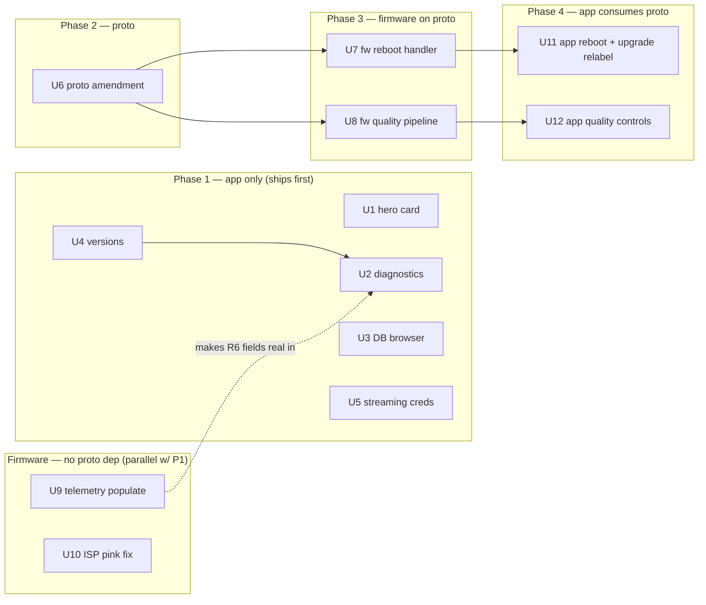

# feat: Make-It-Real Batch — honest UI, real telemetry, cross-repo wiring

**Target repos:** `sst-cam-app` (this repo, plan home), `sst-cam-proto`, `sst-cam-firmware`. Paths below are prefixed with the repo name; within each repo they are repo-relative.

## Summary

Land the confirmed batch as 12 units in 4 phases: an app-only Phase 1 (hero card, diagnostics over the existing `telemetryProvider`, DB-browser redesign, version display, streaming-credential rework) that ships independently, a single additive proto amendment, a firmware phase (reboot handler, runtime-configurable record/stream pipeline, telemetry population, ISP white-balance), and an app phase that consumes the new proto. Diagnostics and real camera-state are pure UI over data the app already polls; the two firmware telemetry/ISP units carry no proto dependency and run parallel to Phase 1.

---

## Problem Frame

The app shows values that are not true (hardcoded versions, a green "LIVE" dot driven only by connection state, an all-mock diagnostics page, a dead quality dropdown, disabled reboot/upgrade buttons) and silently drops saved streaming destinations. The firmware already exposes real telemetry the app does not read, cannot have its record/stream quality set over the wire, and has a known pink color cast with no owner. Full context, requirements, and product decisions live in the origin doc (see Sources & References).

---

## Requirements

**Main hero card**
- R1. Hero card preview button + preview-mode toggle inline (match/session pattern, equal widths).
- R2. Hero card disconnect = danger (red); all hero-card action buttons equal height/width.
- R3. Replace connection-only "LIVE" indicator with real camera state from telemetry (Disconnected/Standby/Preview/Recording/Streaming, precedence Streaming>Recording>Preview>Standby>Disconnected).

**Settings — Diagnostics restructure**
- R4. Dedicated Diagnostics section in Settings covering Camera and App, replacing the mock page.
- R5. Camera diagnostics show real telemetry (storage, temp, RAM, CPU, uptime, wifi state/SSID, recording/streaming/raw flags, network uplink); remove fabricated MTU/RSSI/connection-interval/command-log.
- R6. Stub telemetry (battery, internet-reachable, wifi-RSSI until firmware-wired) shown "unavailable", never faked.
- R7. App diagnostics subsection: app build/version + access to app logs + DB browser.
- R8. Move app log viewer out of Developer settings into Diagnostics.

**Database browser**
- R9. Redesign the database browser UI to match the app design system.

**Versions**
- R10. Replace hardcoded version placeholders with real values: app (package metadata), firmware (device-reported), proto.
- R11. Proto version shows both axes: proto repo SemVer tag and wire `protocol_version`.
- R12. Local/dev builds derive version + channel from git (tag + commits + SHA, branch→channel), not a manual guess.

**Reboot & Upgrade**
- R13. Implement real camera Reboot: new proto command + firmware handler; app button with confirm dialog, disabled while disconnected.
- R14. Rename "Update fw"→"Upgrade"; repurpose to firmware-version + install.sh info (no OTA).

**Recording & streaming quality / fps**
- R15. Independent app-controlled record quality/fps and stream quality/fps, any combination; new proto fields; firmware applies at session start.
- R16. App offers only firmware-advertised modes (firmware advertises supported resolutions/fps).
- R17. The two hidden raw recordings stay fixed at default low-res (720p 30/60), not user-controllable, unaffected by R15.

**Streaming credentials**
- R18. Settings → Streaming destinations becomes custom-RTMP-only (persistent/reusable creds); drop per-platform workflows.
- R19. A match can carry a per-match RTMP url+key (set at setup or mid-match on first stream), stored only on that match.
- R20. Match setup attaches either a saved persistent destination or a per-match one-off, and actually uses it (fixes the ignore-saved-destinations gap).

**Firmware-side fixes**
- R21. Fix the pink color cast in firmware capture/ISP (white-balance/color-correction); app needs no change.
- R22. Firmware populates internet-reachable (existing uplink probe) and wifi-RSSI (wifi manager) so diagnostics show them real.

*Acceptance examples (AE1–AE8) cover R3, R6, R12, R13, R15, R16, R17, R19. Remaining requirements are verified via per-unit test scenarios + on-device validation.*

**Origin actors:** A1 Operator, A2 App, A3 Firmware, A4 Proto contract.
**Origin flows:** F1 configure+start match with quality+streaming, F2 start streaming mid-match no-cred, F3 view diagnostics, F4 reboot.
**Origin acceptance examples:** AE1/AE2 (R3), AE3 (R6), AE4 (R12), AE5 (R13), AE6 (R16), AE7 (R19), AE8 (R15, R17).

---

## Scope Boundaries

- Over-the-wire OTA / firmware upgrade — out; `install.sh` remains the upgrade path (R14 is informational only).
- Per-platform streaming API integration, OAuth, refresh-token storage, app verification, and third-party relay (Castr) — out; all credentials manual.
- Instagram/TikTok live (no programmatic API) and Facebook Live (review-gated) — out.
- Real battery telemetry — out; hardware sensor unconfirmed, tile stays "unavailable".
- `FactoryResetCommand` wiring — out; Reboot (R13) is a distinct new command.
- Changing the raw dual-recording resolution/fps or exposing it — out (R17).
- Live mid-record quality switching — out; quality applies at session start via pipeline (re)configuration.

### Deferred to Follow-Up Work

- A generic reusable ListTile/Input/Dropdown design-system component: not introduced now; redesign composes existing `WfCard`/`WfSection`/`WfNote`/`WfFilterBar`. Capture as a design-system follow-up if row composition proves repetitive.
- `scripts/ci/resolve-version.sh` input-validation hardening against malformed prerelease tags (origin learning doc 7): noted as a risk here; harden in a separate CI-focused PR across all four repos.
- Capturing ISP/white-balance and `package_info` learnings via `/ce-compound` after this batch (no existing `docs/solutions/` coverage).

---

## Context & Research

### Relevant Code and Patterns

**App (`sst-cam-app`)**
- Hero card: `lib/features/camera/main_page.dart` (`_HeroCameraCard`, status dot, secondary button row).
- Pattern to copy for R1/R2: `lib/features/match/session/session_screen.dart` (two `Expanded` columns, `full: true`); danger variant + sizing in `lib/core/widgets/wf_button.dart`.
- Telemetry UI hook (R3/R4/R5/R6): `telemetryProvider` `StreamProvider.family` at `lib/core/ble/ble_providers.dart:39`; model `lib/core/models/telemetry.dart`; example watch in `lib/features/camera/main_page.dart`.
- Settings + diagnostics: `lib/features/settings/settings_page.dart` (`_CameraCard`, reboot/upgrade buttons, version placeholders), `lib/features/discovery/diagnostics_page.dart` (mock, to replace), `lib/features/settings/developer/log_viewer_page.dart` (move target), `lib/features/settings/developer/developer_settings_page.dart`.
- DB browser: `lib/features/discovery/debug_page.dart`.
- Design system: `lib/core/theme/tokens.dart` (`T`), `lib/core/widgets/{wf_card,wf_button,wf_chip,wf_filter_bar,indicators}.dart`.
- Proto boundary (single adapter seam): `lib/core/ble/ble_protocol.dart` (`_toProtoCommand` ~259, `fromProto` ~444, `_dartTelemetry` ~606); command model `lib/core/models/command.dart`; codegen `just gen-proto` → `lib/models/proto/`.
- Streaming: `lib/features/match/setup_screen.dart` (hardcoded local `_StreamMethod` enum, custom-RTMP modal, dead `_Quality` dropdown), `lib/features/settings/streaming/streaming_destination_form_sheet.dart`, model `lib/core/models/streaming.dart`, DAO `lib/core/db/daos/streaming_destinations_dao.dart`.
- Mock contract twin: `lib/mock/emulator/mock_ble_service.dart`, `mock_wifi_service.dart`.
- Tests: `test/` mirrors `lib/`; `just test`; harness `test/test_helpers.dart` (`useInMemoryDb()`); mirror `test/features/settings/developer_settings_page_test.dart`, `test/core/widgets/preview_layout_toggle_test.dart`, `test/core/db/raw_recordings_dao_test.dart`.

**Proto (`sst-cam-proto`)**
- `bluetooth.proto`: `Command` oneof (highest field 58 → reboot = 59), `RecordingControlCommand` (~398), `StreamingControlCommand` (~439), `PushSessionConfigCommand` (~516), `DeviceInfoResponse` (~257), `DeviceTelemetry` (~268; `wifi_signal_dbm=5`, `internet_reachable=6` already defined).
- Rules: additive `optional` = safe/minor `feat:`; `buf breaking` classifier; `reserved` to tombstone. Bump the wire `protocol_version` on a breaking change **or** a new feature-gated command surface (firmware precedent — v2 was bumped for the network-config command surface, app feature-gates on it), but **not** for plain additive optional fields. This batch's `RebootCommand` is a new command surface → bump 2→3 (see U6/U7/U11); the record/stream quality additions are plain optional fields and do not themselves require the bump. `buf.yaml` (`breaking: FILE`). `just lint`, `just breaking`.

**Firmware (`sst-cam-firmware`)**
- Handler pattern (mirror `PreviewLayoutHandler`): `src/app/control/ports/handler.hpp`, `src/app/control/services/handlers/preview-layout.handler.{hpp,cpp}`, registration block `src/main.cpp:253-291`, dispatcher `src/app/control/services/dispatcher/command-dispatcher.cpp`.
- Pipeline config sites: `src/adapters/capture/frame/gstreamer/gstreamer.cpp` (caps from `CameraConfig`, built once in `CreatePipeline()`; `nvarguscamerasrc` with no WB props), `src/domain/capture/models/camera-config.hpp` (`white_balance` declared-but-unapplied), `src/adapters/storage/gstreamer/gst-continuous-recorder.cpp` (`constexpr kFramerate=30`, `kBitrateKbps=8000`), port `src/app/storage/ports/continuous-recorder.hpp` (`Start(output_mp4)`), model-to-mirror `src/domain/streaming/models/platform-stream-config.hpp` (value-object from session config).
- Telemetry: `src/app/control/services/handlers/device.handler.{hpp,cpp}` (`set_internet_reachable(false)` ~line 80; `wifi_signal_dbm` never set); existing `IUplinkProbe` `src/app/streaming/ports/uplink-probe.hpp` (concrete `IpRouteUplinkProbe` `src/main.cpp:169`, injected only into StreamingHandler ~`main.cpp:280`); `WifiStateProvider` functor pattern for RSSI injection.
- Bounded subprocess helper: `src/adapters/control/network/subprocess.{hpp,cpp}` (`RunBounded` with wall-clock deadline + SIGKILL/reap).
- Tests: GTest, `tests/<module>/`; mirror `tests/control/preview_layout_handler.test.cpp`, `tests/control/command_dispatcher.test.cpp`.

### Institutional Learnings

- **Cross-stack contract drift is semantic, not syntactic** (`sst-cam-proto/docs/solutions/architecture-patterns/cross-stack-contract-drift-2026-06-09.md`): pin default/unit/presence in `.proto` prose; declare new scalars `optional`, branch on `has_*()`.
- **Mock must mirror real firmware contract** (`sst-cam-app/docs/solutions/architecture-patterns/mock-must-mirror-real-firmware-contract-2026-06-10.md`): update `MockBleService`/`MockWifiService` for every new field/command or app tests stay green against a fiction.
- **App-side contract alignment** (`sst-cam-app/docs/solutions/integration-issues/app-firmware-contract-alignment-ble-wiring-2026-06-09.md`): new commands need real chunk transport + correlation, not `Future.value()` stubs.
- **Bound every subprocess on the dispatcher thread** (`sst-cam-firmware/docs/solutions/architecture-patterns/bound-every-subprocess-on-the-dispatcher-thread-2026-06-29.md`): reboot exec / any RSSI shellout must use `RunBounded` with a deadline — never bare `waitpid`/`popen` on the single dispatcher thread.
- **Non-blocking sink with async Stop** (`sst-cam-firmware/docs/solutions/architecture-patterns/non-blocking-sink-with-async-stop-2026-06-10.md`): producer hot path never blocks; Stop/teardown under `try_to_lock` + drain outside lock. Orin Nano has no NVENC — software `x264enc` only.
- **install.sh provisions all host prerequisites** (`sst-cam-firmware/docs/solutions/conventions/install-script-provision-all-host-prerequisites-2026-06-24.md`): new GStreamer elements/props resolve at runtime; container build stays green, fails on-device — update sysroot + `install.sh`.
- **Settings toggle: live state vs saved intent** (`sst-cam-app/docs/solutions/logic-errors/settings-toggle-live-state-vs-saved-intent-2026-06-29.md`): separate live-derived display from persisted intent in streaming-destination/match forms.
- **VlcPlayerController.dispose() async LateError** (`sst-cam-app/docs/solutions/runtime-errors/vlc-controller-dispose-lateerror-2026-05-27.md`): relevant if hero-card/state work touches preview lifecycle.
- **Wifi-Direct idempotency** (`sst-cam-firmware/docs/solutions/integration-issues/wifi-direct-data-plane-idempotency-2026-06-26.md`): preview/stream start paths must be idempotent.
- **Malformed prerelease tag bricks resolve-version.sh** (`sst-cam-proto/docs/solutions/.../malformed-prerelease-tag-...md`): validate before cutting tags this batch.

### External References

- Origin streaming research (manual-credential decision): YouTube/Twitch/Kick require OAuth; only a paid relay offers pure API-key generation; manual paste chosen. See origin Key Decisions.

---

## Key Technical Decisions

- **Phase 1 is app-only and ships before any proto/firmware change.** Diagnostics, real camera-state, DB browser, versions, and streaming rework depend on nothing new on the wire — the telemetry poll path and `DeviceTelemetry` model already exist.
- **Telemetry population (R22) is firmware-only.** `wifi_signal_dbm`/`internet_reachable` already exist in the contract; no proto edit. App renders them real automatically once firmware sets them.
- **One proto amendment unit gates reboot + quality.** All additions are `optional`/additive (minor bump, `buf breaking`-clean), batched into a single tag so consumers bump the submodule once per repo.
- **Supported quality modes ride on `DeviceInfoResponse`** (a repeated supported-modes field), not a new capabilities command — the app already reads `DeviceInfoResponse`, so R16 needs no extra round-trip.
- **Quality applies at session start via pipeline (re)configuration, not hot-switching.** Capture caps and the recorder pipeline are built once at start; mirror the existing `PlatformStreamConfig` value-object-from-session-config pattern for the recorder and capture.
- **Reboot side effect goes through an injected port + bounded subprocess.** Mirrors `IUplinkProbe`/`ISystemStats` injection for testability; the exec uses `RunBounded` per the dispatcher-thread learning.
- **Version display: `package_info_plus` for app version + `--dart-define` for git/channel.** CI injects from `resolve-version.sh`; local builds default to a `just`-computed `git describe` + branch→channel; proto shows submodule tag (injected) alongside the wire `protocol_version` from `DeviceInfoResponse`.
- **UI redesigns compose existing design-system widgets** (`WfCard`/`WfSection`/`WfNote`/`WfFilterBar`, `T` tokens, `T.mono` for data) — no new component abstraction.

---

## Open Questions

### Resolved During Planning

- Where does the diagnostics screen get real data? — Existing `telemetryProvider` (`lib/core/ble/ble_providers.dart:39`); pure UI.
- Do internet-reachable / wifi-RSSI need a proto change? — No; fields exist, firmware-population only.
- How are supported quality modes advertised? — New repeated field on `DeviceInfoResponse`.
- Reboot field number? — `Command` oneof field 59 (58 highest used).

### Deferred to Implementation

- Exact resolution/fps mode set the IMX477 + GStreamer pipeline can deliver, and pipeline-restart latency at session start (affects U6/U8/U12). `[Needs research]`
- Exact proto field shapes for record/stream quality and the reboot command payload (affects U6). `[Technical]`
- Precise `git describe`→version-string format + branch→channel mapping in the app `justfile`/CI (affects U4). `[Technical]`
- Pink-cast root cause — white-balance mode vs saturation vs ISP digital-gain — and the exact `nvarguscamerasrc` props (affects U10). `[Needs research]`
- Whether target hardware has any battery/fuel-gauge sensor (gates ever wiring battery; out this batch) (affects U2). `[Technical]`
- BLE reboot trust model: is the firmware dispatcher bonded-device-gated, or is transport pairing the sole trust boundary? Answer decides whether reboot needs a mitigation or just documented acceptance (affects U7). `[Technical]`
- RTMP key at-rest: secure-storage (flutter_secure_storage / Keystore) vs accepted-risk-with-timeline, given all current APKs are debug-signed (affects U5). `[User decision]`

---

## High-Level Technical Design

> *This illustrates the intended approach and is directional guidance for review, not implementation specification. The implementing agent should treat it as context, not code to reproduce.*

Unit dependency graph (phases left→right):

---

## Implementation Units

### U1. Hero card: inline layout, red disconnect, real camera state

**Goal:** Hero card preview button + preview-toggle inline with equal-width/height buttons, red disconnect, and a status indicator that reflects real camera state instead of connection-only "LIVE".

**Requirements:** R1, R2, R3

**Dependencies:** None

**Files:**
- Modify: `sst-cam-app/lib/features/camera/main_page.dart`
- Test: `sst-cam-app/test/features/camera/main_page_hero_card_test.dart`

**Approach:**
- Restructure the secondary row to two `Expanded` columns with `WfButton(..., full: true)`, mirroring `session_screen.dart`'s preview-controls row; disconnect uses `WfButtonVariant.danger`.
- Derive camera state from `telemetryProvider(deviceId)` flags (`is_streaming`/`is_recording`/preview-on/connected) with precedence Streaming>Recording>Preview>Standby>Disconnected. Locked state→token+label map (single source, reused by U2): Disconnected→`T.ink3`/"Disconnected", Standby→`T.warn`/"Standby", Preview→`T.accent`/"Preview", Recording→`T.danger`/"Recording", Streaming→`T.ok`/"Streaming". Inconsistent flag combos (e.g. recording=true while disconnected) resolve to Disconnected (connection gates all live states).

**Patterns to follow:** `lib/features/match/session/session_screen.dart` (Expanded+full row), `lib/core/widgets/wf_button.dart` (variants/sizes), `telemetryProvider` watch in `main_page.dart`.

**Test scenarios:**
- Covers AE1. Happy path: connected + idle telemetry → indicator reads "Standby", not green LIVE.
- Covers AE2. Happy path: telemetry recording+streaming → indicator reads "Streaming" (precedence).
- Happy path: disconnected (null telemetry/deviceId) → "Disconnected" state; disconnect button **disabled** (not hidden) to preserve the equal-width two-button row geometry (consistent with U11 reboot-disabled).
- Edge case: preview on but not recording/streaming → "Preview".
- Widget: both action buttons render equal width (two Expanded) and disconnect uses danger color.

**Verification:** Hero card matches the session-screen button geometry; indicator text/color changes with telemetry state; `just test` green.

---

### U2. Settings Diagnostics section (camera + app) over real telemetry

**Goal:** Replace the mock diagnostics page with a Diagnostics section covering Camera (real telemetry) and App (build/version, logs, DB browser), and move the app log viewer here.

**Requirements:** R4, R5, R6, R7, R8

**Dependencies:** U4 (App subsection's build/version block consumes U4's version source). U2 ships before U4: until U4 lands the version block renders `"—"` (the same unavailable treatment as disconnected telemetry), never a hardcoded version literal; U4 replaces `"—"` with real values. U9 later flips battery/internet/RSSI from "unavailable" to real with no app change.

**Files:**
- Create: `sst-cam-app/lib/features/settings/diagnostics/diagnostics_page.dart`
- Modify: `sst-cam-app/lib/features/settings/settings_page.dart` (route Diagnostics from the camera card), `sst-cam-app/lib/features/settings/developer/developer_settings_page.dart` (remove the logs entry)
- Move/reference: `sst-cam-app/lib/features/settings/developer/log_viewer_page.dart` (now reached from Diagnostics)
- Remove/replace: `sst-cam-app/lib/features/discovery/diagnostics_page.dart` (mock)
- Test: `sst-cam-app/test/features/settings/diagnostics_page_test.dart`

**Approach:**
- Diagnostics is a named row in the Settings screen (within/adjacent to the camera card) that pushes to `diagnostics_page.dart`; the camera card's existing Diagnostics tap routes to the same screen (single entry/route). The old `discovery/diagnostics_page.dart` route is removed.
- Camera subsection watches `telemetryProvider(deviceId)` + `GetNetworkConfig` for storage/temp/RAM/CPU/uptime/wifi/flags/uplink, rendered with `WfCard`/`WfSection`/`WfNote`, `T.mono` for numeric/IDs.
- Fields without real firmware values (battery, internet-reachable, wifi-RSSI) render the value slot as `—` in `T.mono` muted with a sub-label "unavailable" — one treatment applied to every stub field, never a zero.
- Disconnected/no-telemetry: the camera subsection replaces the tile grid with a single `WfNote` ("Connect to a camera to view diagnostics"); this is distinct from the per-tile unavailable treatment. The App subsection has **no** telemetry dependency and renders regardless (do not gate the page on `telemetryProvider`).
- App subsection: build/version block (from U4's version source), a row into the log viewer, and a row into the DB browser gated on `kAppEnv.isDevBackend` (the same dev gate as `developer_settings_page.dart`, enforced at the provider/route level — must survive this move).

**Patterns to follow:** `lib/core/widgets/wf_card.dart` composition; `telemetryProvider` watch; existing `developer_settings_page.dart` row idiom.

**Test scenarios:**
- Happy path: telemetry present → camera tiles show mapped real values (storage/temp/cpu/uptime/wifi/flags).
- Covers AE3. Edge case: firmware reports battery 0 / internet-reachable false / no RSSI → those tiles show "unavailable", never a number.
- Happy path: tapping the logs row opens the log viewer; tapping DB browser row opens it (dev build).
- Edge case: disconnected/no telemetry → camera subsection shows a not-connected state, app subsection still renders.
- Regression: the old mock MTU/RSSI/connection-interval/command-log content is gone.

**Verification:** Diagnostics reachable from the camera card; only real or explicitly-unavailable data shown; logs no longer under Developer; `just test` green.

---

### U3. Database browser redesign

**Goal:** Rebuild the DB browser UI in the app design language.

**Requirements:** R9

**Dependencies:** None

**Files:**
- Modify: `sst-cam-app/lib/features/discovery/debug_page.dart`
- Test: `sst-cam-app/test/features/discovery/debug_page_test.dart`

**Approach:**
- Replace ad-hoc styling with `WfCard`/`WfSection`/`WfNote` + `WfFilterBar` for the table picker; `T.mono` for cell/ID data; preserve the existing 4-tab Drift inspector + reset/reseed behavior unchanged.
- Empty table renders a centered `WfNote` ("No rows in this table"), no crash.
- Credential columns (`streaming_destinations` url/key, and per-match RTMP fields from U5) render **masked** with **per-column** reveal toggles (url and key independently revealable); key masked by default as a fixed-width `••••••••`. The browser must not show stream keys in plaintext by default (see Security constraints).

**Patterns to follow:** `lib/core/widgets/wf_filter_bar.dart` (picker), `lib/core/theme/tokens.dart`; keep `dev_reseeder` wiring intact.

**Test scenarios:**
- Happy path: each table tab renders rows via the in-memory drift DB harness.
- Edge case: empty table → empty-state treatment, no crash.
- Integration: reset/reseed action repopulates rows (drift reset-in-place, do not close `appDatabaseProvider`).

**Verification:** DB browser visually consistent with the app; all existing inspect/reset functions still work; `just test` green.

---

### U4. Real version display + local-build derivation

**Goal:** Show real app/firmware/proto versions; derive local-build version + channel from git.

**Requirements:** R10, R11, R12

**Dependencies:** None

**Files:**
- Modify: `sst-cam-app/pubspec.yaml` (add `package_info_plus`), `sst-cam-app/lib/features/settings/settings_page.dart` (About + camera-card version strings), `sst-cam-app/justfile` (compute `--dart-define` git/channel), relevant `.github/workflows/release-*.yml` (inject version/channel defines)
- Create: `sst-cam-app/lib/core/version/version_info.dart` (plain helper assembling app/proto/firmware/channel strings — no injectable wrapper)
- Test: `sst-cam-app/test/core/version/version_info_test.dart`

**Approach:**
- App version + build from `package_info_plus`; git-describe string + channel injected via `--dart-define` (CI from `resolve-version.sh`; local default computed in `justfile` as `git describe` + branch→channel alpha/beta/stable).
- Proto version: submodule tag injected via `--dart-define` (build-time) shown alongside the wire `protocol_version` read from `DeviceInfoResponse` (`ble_protocol.dart:444`).
- Firmware version from `DeviceInfoResponse.firmware_version` (already mapped); wire into the camera card replacing the hardcoded string.
- `version_info.dart` is a plain helper (the `--dart-define` git/channel logic is a static function; no injectable interface). The test installs `PackageInfo.setMockInitialValues(...)` in setup (a bare `flutter test` otherwise throws `MissingPluginException` on the `package_info_plus` MethodChannel).

**Patterns to follow:** existing `--dart-define` flavor handling (`main.dart`/`main_prod.dart`); `resolve-version.sh` channel ladder.

**Test scenarios:**
- Covers AE4. Happy path: defines for `0.1.0-alpha.4+2-gabc123` on a feature branch → version_info reports that string on the alpha channel.
- Happy path: app version resolves from package metadata when no define present.
- Edge case: missing/empty defines (bare local build) → graceful fallback string (e.g. `dev`), no crash.
- Happy path: proto display shows both the injected SemVer tag and the device-reported `protocol_version` int.
- Edge case: disconnected → firmware/protocol-version show "—" rather than stale/hardcoded.

**Verification:** No hardcoded version literals remain in settings; About/camera-card/diagnostics show real values; local build shows a git-derived version+channel; `just test` green.

---

### U5. Streaming credentials: custom-only destinations + per-match creds + attach gap fix

**Goal:** Make Settings destinations custom-RTMP-only, let a match carry a per-match credential (setup or mid-match), and actually use the chosen destination.

**Requirements:** R18, R19, R20

**Dependencies:** None

**Files:**
- Schema: `sst-cam-app/lib/core/db/tables/team_matches_table.dart` (add nullable `rtmpUrl`/`streamKey` columns for the per-match credential), the Drift database file (bump `schemaVersion` 4→5 + add the `MigrationStrategy` step), then run `just gen-db`
- Modify: `sst-cam-app/lib/features/settings/streaming/streaming_destination_form_sheet.dart` (custom-RTMP only), `sst-cam-app/lib/features/settings/streaming/streaming_state.dart`, `sst-cam-app/lib/features/match/setup_screen.dart` (replace local `_StreamMethod` enum with real destination picker; per-match one-off entry), `sst-cam-app/lib/core/models/command.dart` (carry credential on session config if not already), `sst-cam-app/lib/features/match/session/session_screen.dart` (mid-match start-stream-with-no-cred prompt)
- Modify: `sst-cam-app/lib/mock/emulator/mock_ble_service.dart` (observe the destination on streaming-control)
- Test: `sst-cam-app/test/features/match/setup_screen_streaming_test.dart`, `sst-cam-app/test/features/match/session_midmatch_stream_test.dart`, `sst-cam-app/test/core/db/match_streaming_migration_test.dart`

**Approach:**
- Add the per-match credential columns + migration first (else the per-match write hits a missing column at runtime). Confirm whether `team_matches` already has a usable JSON/blob column before adding new columns; prefer two explicit nullable columns.
- Settings destination form reduced to custom-RTMP (persistent/reusable). Match setup reads saved `StreamingDestination`s (via `streaming_state`) via a `WfFilterBar`-style selector listing saved destinations plus a "+ One-off" option that expands an inline RTMP url+key form (no separate sheet); per-match creds persist only on the match record, not the global DAO.
- Mid-match: starting streaming with no credential opens a **non-dismissible** modal bottom sheet (`isDismissible: false, enableDrag: false`, matching the existing custom-RTMP modal) with RTMP url + stream-key fields, an explicit Cancel, and a "Start streaming" confirm; both Cancel and any dismiss path start nothing and leave the session unchanged. On confirm, store on the match, then send streaming-control. Keep live-state display separate from saved intent (learning doc 15).
- RTMP url validation (`rtmp(s)://` required) renders as an **inline field-level error** below the url input in both the setup one-off form and the mid-match sheet; the confirm/start button stays disabled until the url validates (Flutter `Form` validator pattern).
- The chosen url+key flows through the existing `StreamingControlCommand(destination=...)` path (no firmware/proto change).
- Credential fields (`rtmpUrl`/`streamKey`) must **never** be written to the app log — redact/omit them at the `ble_protocol.dart` and `streaming_state` logging callsites (the log viewer is now reachable from Diagnostics, U2/U8). See Security constraints.

**Patterns to follow:** `lib/core/models/streaming.dart` + DAO; existing custom-RTMP modal; `ble_protocol.dart` streaming-control send; settings live-vs-saved separation.

**Test scenarios:**
- Covers AE7. Integration: match with no cred → start streaming mid-match → prompt → stored on match only → streaming-control sent with that destination; cred absent from global destinations afterward.
- Happy path: pick a saved persistent destination at setup → that destination's url+key reaches the start path (fixes the dropped-destination gap).
- Happy path: enter a per-match one-off at setup → used for the match, not saved globally.
- Edge case: invalid RTMP url (no `rtmp(s)://`) → validation error, no send.
- Regression: Settings destination form no longer offers YouTube/Instagram per-platform options.

**Verification:** Saved destinations actually stream; per-match creds are match-scoped; mid-match prompt works; `just test` green.

---

### U6. Proto amendment: reboot command, record/stream quality, supported modes

**Goal:** Additively amend the contract for reboot, independent record/stream quality+fps, and firmware-advertised supported modes.

**Requirements:** R13, R15, R16

**Dependencies:** None (blocks U7, U8, U11, U12)

**Files:**
- Modify: `sst-cam-proto/bluetooth.proto`
- Verify: `sst-cam-proto` `just lint`, `just breaking`

**Approach:**
- Add a `RebootCommand` to the `Command` oneof at field 59, parameterless (no mode) — avoids a BLE-derived argument on the reboot exec path; if a mode is ever needed, add an `enum` with validated values, never a free string.
- Add `optional` quality/fps fields, placement **committed** (U8/U12 reference these exact locations): record resolution+fps on `RecordingControlCommand`, stream resolution+fps on `StreamingControlCommand` — independently settable, matching where each is consumed firmware-side. Document default/unit/presence inline; consumers branch on `has_*()`.
- Add a repeated supported-modes field to `DeviceInfoResponse` so firmware advertises real modes (R16).
- Keep it additive: no renumbering, `reserved` not needed (no removals); minor `feat:` bump; consumers pin a new tag.
- **protocol_version decision:** the new `RebootCommand`/quality surface is feature-gated by bumping the wire `protocol_version` 2→3. The value is **not** in the proto file — `kProtocolVersion` is a firmware constant (`sst-cam-firmware/src/app/control/services/handlers/device.handler.cpp:17`, currently 2), so the actual bump lands in **U7** (firmware); the app's compare value `kAppProtocolVersion` (currently 2) bumps to 3 in **U11**. U6 only documents the intent in proto prose. U11/U12 gate availability on `protocol_version >= 3` rather than relying solely on an `UNSUPPORTED` response. (Current state: firmware and app co-pinned at 2.)

**Patterns to follow:** proto `CLAUDE.md` schema rules; `PlatformStreamConfig` field naming (width/height/framerate); cross-stack-contract-drift learning (pin default/unit/presence in prose, declare `optional`).

**Test scenarios:** `Test expectation: none — schema-only`. Gate on `just lint` clean and `just breaking` reporting additive/minor (no breaking change).

**Verification:** `buf lint`/`buf breaking` clean; new tag cut on the proto ladder; field numbers documented; ready for both consumers to bump.

---

### U7. Firmware Reboot handler

**Goal:** Implement the reboot command end-to-end in firmware via an injected, bounded port.

**Requirements:** R13

**Dependencies:** U6 (proto tag), bump firmware proto submodule

**Files:**
- Create: `sst-cam-firmware/src/app/control/services/handlers/reboot.handler.{hpp,cpp}`, a reboot port (e.g. `src/app/control/ports/reboot.hpp`) + concrete adapter using the bounded subprocess helper
- Modify: `sst-cam-firmware/src/main.cpp` (register handler + wire port), `sst-cam-firmware/src/app/control/services/handlers/device.handler.cpp:17` (bump `kProtocolVersion` 2→3 for the new command surface), proto submodule pin, `sst-cam-firmware/deploy/install.sh` if a new system capability/permission is needed to reboot
- Test: `sst-cam-firmware/tests/control/reboot_handler.test.cpp`

**Approach:**
- Mirror `PreviewLayoutHandler`: `HandledCases()` returns `{Command::kReboot}`; `Handle()` invokes the injected reboot port and returns `status(OK)` (the reboot will follow). The port exec uses `RunBounded` with a wall-clock deadline (learning doc 8) — never a bare shellout on the dispatcher thread.
- Keep the actual reboot behind the port so the handler is unit-testable with a fake.

**Execution note:** Add the handler/dispatcher test first (contract: kReboot handled, OK returned, port invoked once), then implement.

**Patterns to follow:** `preview-layout.handler.{hpp,cpp}`, `IUplinkProbe` injection style, `src/adapters/control/network/subprocess.{hpp,cpp}`.

**Test scenarios:**
- Covers AE5 (firmware half). Happy path: a reboot command routes to the handler, the injected port is invoked exactly once, response status OK.
- Edge case: `HandledCases()` includes `kReboot`; dispatcher routes it (not UNSUPPORTED).
- Error path: port/exec failure → handler returns a non-OK status rather than crashing the dispatcher.

**Verification:** ctest green in the dev container; on-device reboot confirmed via `install.sh --binary` deploy; dispatcher no longer returns UNSUPPORTED for reboot.

---

### U8. Firmware runtime-configurable record + stream quality

**Goal:** Apply app-supplied record and stream resolution/fps at session start; advertise supported modes; leave raw recordings untouched.

**Requirements:** R15, R16, R17

**Dependencies:** U6 (proto tag), firmware proto submodule bump

**Files:**
- Modify: `sst-cam-firmware/src/adapters/storage/gstreamer/gst-continuous-recorder.cpp` + port `src/app/storage/ports/continuous-recorder.hpp` (`Start` takes quality params), `src/adapters/capture/frame/gstreamer/gstreamer.cpp` (per-branch `nvvidconv`/`videoscale`, capture caps unchanged), `src/adapters/storage/raw_capture/filesystem-raw-capture-sink.cpp` (raw branch stays 720p), `src/app/storage/services/recording-service.cpp` (the `Start` caller), session/streaming handlers (`src/app/control/services/handlers/session.handler.cpp`, `streaming.handler.cpp`) to read the new proto fields, `DeviceHandler` to advertise supported modes, `src/main.cpp` wiring, `deploy/install.sh`/sysroot if new encoder elements/props are introduced
- Test: `sst-cam-firmware/tests/storage/continuous_recorder_config.test.cpp`, `sst-cam-firmware/tests/control/quality_config.test.cpp`, raw-resolution assertion in `tests/storage/` against the raw sink

**Approach:**
- Turn the recorder's `constexpr` framerate/bitrate into config carried from session start (mirror `PlatformStreamConfig` value-object). Record quality and stream quality are independent — record drives the continuous recorder (`recording-service.cpp:111`, the sole `IContinuousRecorder::Start` caller), stream drives `PlatformStreamConfig`.
- **Resolution independence is realized by per-branch scaling, not by changing capture caps.** The raw sink (`IRawCaptureSink`, `src/adapters/storage/raw_capture/filesystem-raw-capture-sink.cpp`) and the recorder consume frames from one `nvarguscamerasrc` whose size comes from a single `CameraConfig` — so changing `CameraConfig.width/height` would also change the raw frame. Keep capture at one resolution and insert a per-branch `nvvidconv`/`videoscale` before each encoder: raw branch fixed to 720p, record branch scaled to session resolution. fps likewise per-branch. (Resolve the deferred pipeline-mode research before committing.)
- The `IContinuousRecorder::Start(output_mp4)` port signature gains quality params, plumbed from session config; the raw sink keeps its own fixed 720p 30/60. The R17 regression test asserts the **raw sink's** output resolution, not a recorder overload.
- Capture res/fps threaded into `CameraConfig` at adapter construction; caps are built once so applying happens at session-start pipeline (re)configuration (Stop/teardown under `try_to_lock` + drain outside lock, learning doc 9). Software `x264enc` only (no NVENC).
- Advertise the concrete supported mode set on `DeviceInfoResponse`.
- The two raw recordings keep their fixed 720p 30/60 path — explicitly not driven by the new fields.

**Patterns to follow:** `platform-stream-config.hpp` (value-object from session config), non-blocking-sink-with-async-stop learning.

**Test scenarios:**
- Covers AE8 (firmware half). Happy path: record=1080p, stream=720p in session config → recorder pipeline built with 1080p params, platform stream with 720p params.
- Happy path: unset quality fields (`!has_*()`) → fall back to current defaults.
- Edge case: requested mode not in the supported set → reject/clamp to a supported mode (documented behavior), not a broken pipeline.
- Regression: raw dual-record params unchanged regardless of record/stream quality.
- Integration: supported-modes advertised in `DeviceInfoResponse` matches what the pipeline accepts.

**Verification:** On-device, record and stream run at independently-set qualities; raw unchanged; advertised modes match reality; ctest green.

---

### U9. Firmware telemetry population (internet-reachable + wifi-RSSI)

**Goal:** Populate the two real-but-unset telemetry fields so diagnostics show them.

**Requirements:** R22 (satisfies R6 for these two fields)

**Dependencies:** None (no proto change — fields already exist). Parallel with Phase 1.

**Files:**
- Modify: `sst-cam-firmware/src/app/control/services/handlers/device.handler.{hpp,cpp}` (inject reachability + RSSI providers; set both fields), `sst-cam-firmware/src/main.cpp` (wire `IUplinkProbe` + a wifi-RSSI provider into `DeviceHandler` at the telemetry construction site)
- Test: `sst-cam-firmware/tests/control/device_handler_telemetry.test.cpp`

**Approach:**
- `DeviceHandler`'s constructor and its `dispatcher.Register(...)` call in `main.cpp` gain an `IUplinkProbe*` param (shared with StreamingHandler); set `internet_reachable` from it.
- For RSSI: extend `sst::control::WifiState` with an `rssi` field that `WifiManager` populates (the current `WifiStateProvider` returns only connected/ssid), or inject a distinct RSSI functor — either way name the `main.cpp` wiring site. Set `wifi_signal_dbm` from it.
- Any probe that shells out must use the bounded subprocess helper (learning doc 8) so telemetry polling can't stall the dispatcher thread.

**Patterns to follow:** `IUplinkProbe` usage in StreamingHandler; `WifiStateProvider` functor; `RunBounded`.

**Test scenarios:**
- Happy path: probe reports reachable=true, RSSI=−54 → telemetry carries those values.
- Edge case: probe unavailable/timeout → reachable=false / RSSI unset (so app shows "unavailable"), no stall.
- Integration: a bounded exec that exceeds its deadline is killed/reaped and telemetry still returns promptly.

**Verification:** App diagnostics show real internet-reachable + RSSI on device; telemetry poll latency unaffected; ctest green.

---

### U10. Firmware ISP pink-cast fix

**Goal:** Correct the pink color cast by applying white-balance/ISP props in the capture pipeline.

**Requirements:** R21

**Dependencies:** None. Parallel with Phase 1.

**Files:**
- Modify: `sst-cam-firmware/src/adapters/capture/frame/gstreamer/gstreamer.cpp` (emit ISP/WB props into the `nvarguscamerasrc` string), `src/domain/capture/models/camera-config.hpp` (apply the already-declared `white_balance`), `deploy/install.sh`/sysroot if a new element/plugin is required
- Test: `sst-cam-firmware/tests/capture/pipeline_string.test.cpp`

**Approach:**
- Drive `wbmode`/`saturation`/`ispdigitalgainrange` (and related) from `CameraConfig` into the `nvarguscamerasrc` caps string; wire the declared-but-unused `white_balance` field. Exact props pending pink-cast root-cause (deferred research).
- Note: device-build-only props resolve at runtime — verify on-device, not just container build (learning doc 10).

**Execution note:** Characterize first — capture a frame with current vs candidate WB settings on device before locking the props.

**Patterns to follow:** existing `CreatePipeline()` caps-string construction.

**Test scenarios:**
- Happy path (unit): pipeline string includes the WB/ISP props derived from `CameraConfig`.
- Edge case: `white_balance=auto` default → produces a sane prop set, not malformed caps.
- On-device verification (manual): color is correct (no pink) on real hardware — primary acceptance.

**Verification:** Image shows correct color on the Jetson; pipeline string carries the props; container build + ctest green; on-device color confirmed.

---

### U11. App: Reboot button wiring + Upgrade relabel

**Goal:** Wire the real Reboot command and relabel/repurpose the Upgrade button.

**Requirements:** R13, R14

**Dependencies:** U6 (proto tag), U7 (firmware handler for real effect); bump app proto submodule + `just gen-proto`

**Files:**
- Modify: `sst-cam-app/lib/core/models/command.dart` (add `RebootCommand`), `sst-cam-app/lib/core/ble/ble_protocol.dart` (`_toProtoCommand` case ~259), `sst-cam-app/lib/features/settings/settings_page.dart` (`_CameraCard` — wire Reboot with confirm dialog + disabled-when-disconnected; rename Update fw→Upgrade with version/install.sh info), `sst-cam-app/lib/mock/emulator/mock_ble_service.dart` (handle reboot), proto submodule pin + regenerated `lib/models/proto/`
- Test: `sst-cam-app/test/features/settings/camera_card_reboot_test.dart`, `sst-cam-app/test/core/ble/ble_protocol_reboot_test.dart`

**Approach:**
- Add `RebootCommand` to the sealed command hierarchy + the adapter switch; send via real chunk transport (not a `Future.value()` stub). Confirm dialog before send; button disabled while disconnected. Gate Reboot enablement on `protocol_version >= 3` (also bump `kAppProtocolVersion` to 3 so the co-pinned connect check passes); still handle a `CommandResponse` `UNSUPPORTED` defensively for older firmware.
- Update the mock to observe/ack reboot so app tests exercise the real wire shape (mock-must-mirror).
- Relabel Upgrade and show firmware version + "managed via install.sh" info instead of a no-op.

**Patterns to follow:** existing command cases in `ble_protocol.dart`; mock command handling; confirm-dialog idiom in settings.

**Test scenarios:**
- Covers AE5 (app half). Happy path: connected → tap Reboot → confirm → a reboot command is encoded and sent.
- Edge case: disconnected → Reboot disabled; no command on tap.
- Happy path: cancel the confirm dialog → no command sent.
- Integration: `_toProtoCommand` produces the field-59 reboot payload; mock receives it.
- Happy path: Upgrade button shows firmware version + install.sh info, performs no fake action.

**Verification:** Reboot reaches firmware (real device reboots); disabled-state + confirm correct; Upgrade relabeled; mock-backed tests green.

---

### U12. App: independent record + stream quality controls

**Goal:** Let the operator pick record and stream quality/fps independently from firmware-advertised modes, and send them.

**Requirements:** R15, R16, R17

**Dependencies:** U6 (proto tag), U8 (firmware consumes + advertises); bump app proto submodule + `just gen-proto`

**Files:**
- Modify: `sst-cam-app/lib/features/match/setup_screen.dart` (replace the dead `_Quality` dropdown with two independent pickers fed by advertised modes), `sst-cam-app/lib/core/models/command.dart` + `lib/core/ble/ble_protocol.dart` (carry record/stream quality on the send path), read supported modes from `DeviceInfoResponse`, `sst-cam-app/lib/mock/emulator/mock_ble_service.dart` (advertise modes + observe quality)
- Test: `sst-cam-app/test/features/match/setup_quality_test.dart`, `sst-cam-app/test/core/ble/ble_protocol_quality_test.dart`

**Approach:**
- Two pickers (record, stream) populated from the device-advertised supported modes (`DeviceInfoResponse`), using `WfFilterBar`/picker idiom. Values flow into the session/streaming config send path and onto the wire.
- Gate availability on `protocol_version >= 3`; against older/disconnected firmware (no advertised modes) the pickers are **shown but disabled** with a sub-label "Connect to camera to load available modes" — not hidden — consistent with the disconnected-state pattern.
- Raw recordings are not represented in these controls (R17).
- Mock advertises a representative supported-mode set and records what quality it received, so tests prove the wire path.

**Patterns to follow:** `wf_filter_bar.dart` picker; `ble_protocol.dart` send path; mock-must-mirror.

**Test scenarios:**
- Covers AE6. Happy path: firmware advertises {1080p30,1080p60,720p30,720p60} → pickers offer exactly those (no 4K).
- Covers AE8 (app half). Happy path: record=1080p, stream=720p → both encoded independently and sent.
- Edge case: no advertised modes (older/disconnected firmware) → pickers shown but **disabled** with the "Connect to camera to load available modes" sub-label present, no crash.
- Regression: the previously-dead dropdown value now actually reaches the wire (assert via mock capture).

**Verification:** Pickers reflect real device capabilities; independent record/stream quality reach firmware; `just test` green.

---

## System-Wide Impact

- **Interaction graph:** new `RebootCommand` + quality fields cross the single app adapter seam (`ble_protocol.dart`) and the firmware dispatcher; the mock services are a second contract consumer and must mirror both.
- **Error propagation:** firmware reboot/RSSI/uplink execs must be bounded on the dispatcher thread (deadline + reap) so a hung shellout can't stall all BLE commands; app sends must surface non-OK `CommandResponse` rather than assuming success.
- **State lifecycle risks:** quality changes trigger pipeline (re)configuration at session start — Stop/teardown under `try_to_lock` + drain outside lock; preview/stream start paths must stay idempotent on abrupt BLE drop.
- **API surface parity:** every new proto field/command is mirrored in `MockBleService`/`MockWifiService`; the app proto submodule and firmware proto submodule must pin the **same** proto tag.
- **Integration coverage:** mock-backed app tests prove the wire shape (reboot payload, quality fields, advertised modes); firmware ctest proves handler routing + pipeline config; on-device deploy proves reboot, color, real telemetry, and independent quality.
- **Unchanged invariants:** raw dual-recording path (R17), existing streaming-control destination wire format (R18–R20 reuse it). `protocol_version` bumps 2→3 for the new `RebootCommand` surface (per firmware precedent); both consumers move together since co-pinned.

### Security constraints (cross-cutting)

- **Stream keys are secrets.** Credential columns (`streaming_destinations` url/key; per-match `rtmpUrl`/`streamKey`) render **masked with a reveal toggle** in the DB browser (U3), and the DB browser stays **dev-flavor-gated at the provider/route level** (not just UI), a gate that must survive the U2 move into Diagnostics.
- **Never log credentials.** `rtmpUrl`/`streamKey` are redacted/omitted at every logging callsite (`ble_protocol.dart`, `streaming_state`, and `mock_ble_service.dart`) — verified before the log viewer moves to Diagnostics (U2/U5).
- **Backup excludes credentials.** `BackupService` omits the `rtmpUrl`/`streamKey` columns (`streaming_destinations` + `team_matches`) from its JSON export; restore leaves them null and the user re-enters. Keys never leave the device in a backup file.
- **Synthetic creds in tests.** Test fixtures, `dev_reseeder` seeds, and the migration test use clearly-synthetic placeholders (e.g. `rtmp://test.invalid/live`, key `TEST_KEY_DO_NOT_USE`) — never real-looking keys.
- **Subprocess args are argv, not shell.** Firmware reboot/RSSI/uplink execs (U7/U9) pass fixed `execv`-style argv arrays; no BLE-derived data is concatenated into a shell string. `RebootCommand` is parameterless (U6) to keep the reboot path data-free.
- **BLE reboot trust model (decision — see Open Questions):** the plan assumes BLE pairing/bonding is the sole caller-trust boundary; reboot adds no per-command authz beyond that. If the dispatcher does not enforce bonded-device-only, that assumption needs a minimal mitigation. Confirm before U7.
- **RTMP at-rest (decision — see Open Questions):** keys sit in the Drift SQLite DB; on debug-signed APKs (all current builds) the DB is ADB-accessible. Decide secure-storage vs accepted-risk-with-timeline before U5 ships.

---

## Risks & Dependencies

| Risk | Mitigation |
|------|------------|
| Proto/mock drift leaves app tests green against a fiction | Update mock services in lockstep with U6; assert wire shape via mock capture in U11/U12 (learning doc 4). |
| Unbounded firmware exec (reboot/RSSI/uplink) stalls the dispatcher thread | Route every exec through `RunBounded` with a deadline (learning doc 8); U7/U9 explicitly. |
| GStreamer pipeline reconfigure races the producer hot path | Stop/teardown under `try_to_lock` + drain outside lock; software `x264enc` only (learning doc 9). |
| New encoder/ISP element passes container build, fails on-device | Update sysroot + `install.sh`; verify on-device, not just ctest (learning doc 10). |
| Same proto tag not pinned in both consumers → semantic skew | Bump + regen in both repos against one tag; cross-stack-drift checklist (learning docs 1/6). |
| Pink-cast root cause unknown until on-device | U10 characterizes current-vs-candidate WB on device before locking props. |
| Cutting tags this batch hits the malformed-prerelease-tag resolver crash | Verify no malformed tag exists before tagging; resolver hardening deferred to a separate PR (learning doc 7). |
| Stream keys leak via DB browser, app logs, or at-rest SQLite | Mask + dev-gate the browser, redact creds from logs, argv-not-shell execs; at-rest policy resolved in Open Questions before U5 ships (Security constraints). |
| Per-match credential write hits a missing DB column at runtime | U5 adds the `team_matches` columns + `schemaVersion` bump + migration before the write path, with a migration test. |

---

## Documentation / Operational Notes

- After the batch, capture ISP/white-balance and `package_info`/version-display learnings via `/ce-compound` (no existing `docs/solutions/` coverage).
- Proto change ships on the alpha→beta→stable ladder; app/firmware consume via submodule bump (root is not a git repo; firmware builds/tests only inside its dev container).
- On-device validation gates: reboot (U7/U11), correct color (U10), real telemetry (U9), independent quality (U8/U12) — verify via `deploy/install.sh --binary` and phone deploy.

---

## Phased Delivery

### Phase 1 — App-only (ships first, no wire change)
- U1 hero card, U2 diagnostics, U3 DB browser, U4 versions, U5 streaming creds.

### Phase 1b — Firmware, no proto dependency (parallel with Phase 1)
- U9 telemetry population, U10 ISP pink fix. (U9 makes U2's battery/internet/RSSI fields real.)

### Phase 2 — Proto amendment
- U6 (single additive tag; gates the rest).

### Phase 3 — Firmware on the new proto
- U7 reboot handler, U8 record/stream quality pipeline.

### Phase 4 — App consumes the new proto
- U11 reboot button + Upgrade relabel, U12 independent quality controls.

---

## Sources & References

- **Origin document:** [docs/brainstorms/2026-06-29-make-it-real-batch-requirements.md](../brainstorms/2026-06-29-make-it-real-batch-requirements.md)
- Pattern refs: `sst-cam-app/lib/features/match/session/session_screen.dart`, `sst-cam-app/lib/core/widgets/`, `sst-cam-app/lib/core/ble/ble_protocol.dart`, `sst-cam-firmware/src/app/control/services/handlers/preview-layout.handler.cpp`, `sst-cam-firmware/src/domain/streaming/models/platform-stream-config.hpp`, `sst-cam-proto/bluetooth.proto`.
- Learnings: `sst-cam-proto/docs/solutions/architecture-patterns/cross-stack-contract-drift-2026-06-09.md`, `sst-cam-firmware/docs/solutions/architecture-patterns/bound-every-subprocess-on-the-dispatcher-thread-2026-06-29.md`, `sst-cam-firmware/docs/solutions/architecture-patterns/non-blocking-sink-with-async-stop-2026-06-10.md`, `sst-cam-app/docs/solutions/architecture-patterns/mock-must-mirror-real-firmware-contract-2026-06-10.md`, `sst-cam-app/docs/solutions/logic-errors/settings-toggle-live-state-vs-saved-intent-2026-06-29.md`.
